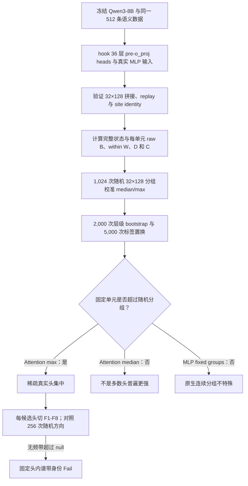
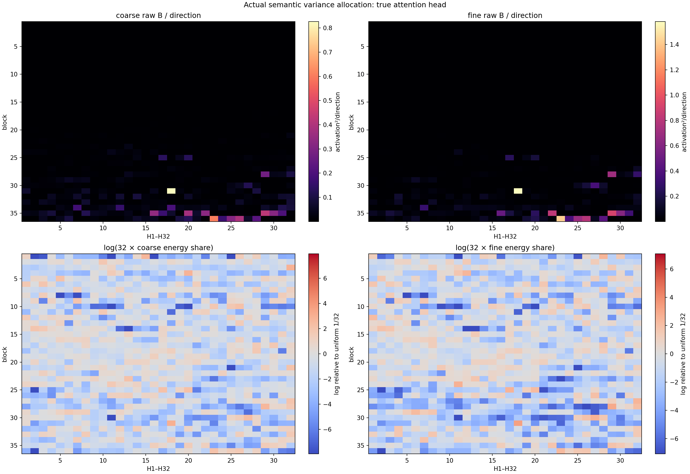
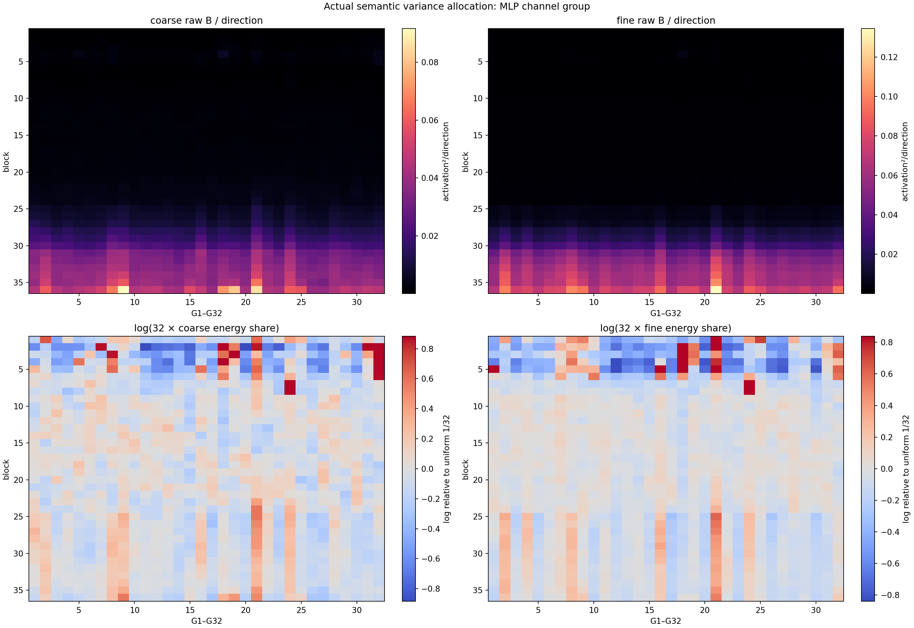
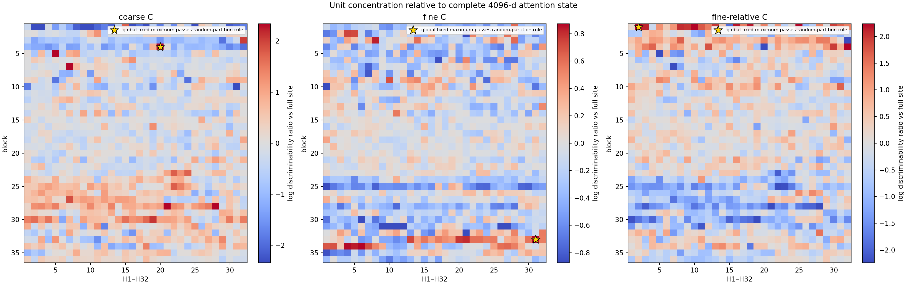
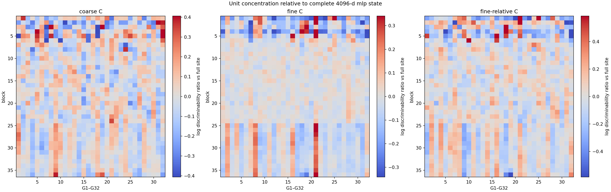
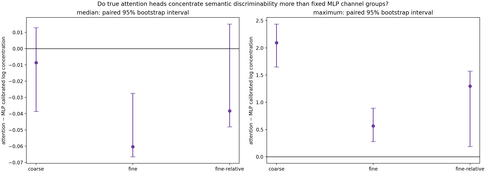
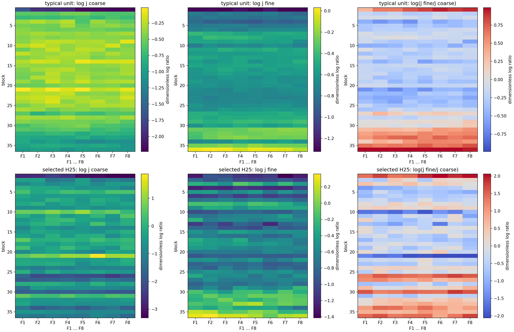
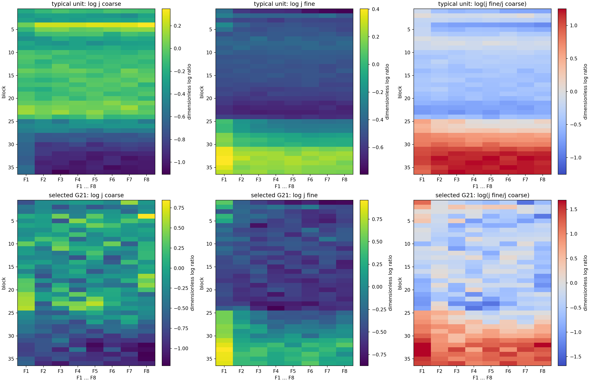

# Qwen3-8B 粗细语义在真实注意力头与 MLP 输入固定分组中的集中性

> 冻结大模型的表示审计、随机切分校准、头内八频带定位与 Router 设计启示

## 摘要

本实验追问：Qwen3-8B 深层表征能够区分粗粒度学科与条件内细粒度概念，这种区分究竟均匀分布在 4096 维表征中，还是集中在较小的内部单元？

我们冻结本地 Qwen3-8B，在全部 36 个 block 同时读取两个位置：一是 `self_attn.o_proj` 前的 32 个真实 query-head 输出，每头 128 维；二是 post-attention RMSNorm 后、直接进入 MLP 的 4096 维表征，并按原生通道顺序切成 32 个连续 128 维组。两个位置复用同一套 512 条无标签泄漏的 8×8 粗细语义文本和独立的 65,536-token DCLM calibration。模型没有微调或继续训练。

主指标是“类间语义方差相对同类措辞方差”的区分度 $D$，再用 $C=\log(D_{unit}/D_{full})$ 比较一个 128 维单元与完整 4096 维表征。为排除从 1,152 个单元中挑最大值的选择偏差，每个站点都用 1,024 次随机 32×128 通道切分的全局最大值 q95 校准，并使用 2,000 次层级配对 bootstrap。

结果是：少数真实 attention heads 的粗、细和细相对粗区分度均显著超过随机切分；但 attention median 不通过，说明不是多数头普遍更强。MLP 输入的固定连续通道组全部低于随机切分 q95。原始语义方差也显示 attention head 分配高度不均，而 MLP 组接近均匀。进一步把每个 128 维单元切成八个 16 维 covariance 频带后，没有一个通过集中资格门的真实 attention 候选频带超过随机 16 维方向。

决定性认识是：

> 粗细语义在 `o_proj` 前具有稀疏的“头身份”集中，但这种身份在混合后的固定 MLP 通道坐标中消失；目前证据不支持把固定头内 covariance rank 直接当成语义或 Router 坐标。

---

## 1. 引言：为什么比较真实头与 MLP 输入分组？

前一轮全层 residual 审计表明，Qwen3-8B 的晚层对同一粗类别内部的细类别更容易区分。但完整 residual 是多个计算来源的混合结果：

```text
各 attention head 输出
→ 拼接
→ o_proj 跨头线性混合
→ 与 residual 相加
→ post-attention RMSNorm
→ MLP
```

因此，完整表征中的语义区分增强可能有三种解释：

1. 多数注意力头共同增强；
2. 少数注意力头承担异常集中的语义信号；
3. 信号只有在 `o_proj`、残差与归一化混合后，才出现在某些固定通道组。

本实验用相同维度的 32×128 单元比较两个站点，以区分这三种解释。它不是比较“多头注意力”和“单头注意力”的模型性能，也不是训练新的 Router。

---

## 2. 唯一问题与可证伪假设

唯一问题是：

> 粗粒度与细粒度语义的区分度，是否特别集中在少数真实 attention heads，而不是 MLP 输入的固定连续通道组；这种集中是否超过任意同形状随机切分？

四条假设分别裁定：

- **H1，真实头集中：**真实头的 median 或 selection-corrected max 超过随机 32×128 分组。
- **H2，MLP 组集中：**固定连续 G1--G32 的 median 或 max 超过自己的随机分组。
- **H3，站点差异：**各自减去随机 q95 后，attention 的集中性仍高于 MLP。
- **H4，头内频带特异：**通过集中门的单元中，某个固定 F1--F8 超过同单元随机 16 维方向。

最强 rival 是：任意把 4096 维切成 32 组，最大组都可能高于完整表征；如果没有随机最大值零假设，“最佳头”只是搜索空间造成的偶然峰值。

---

## 3. 模型与精确表征对象

| 项目 | 冻结值 |
| --- | --- |
| 模型 | `/data/share/Qwen3-8B` |
| 模型/Tokenizer manifest | `3e33117aebc01710cf1011093bbf4c2700336fce4600788f15d80d69f165dc25` |
| 模型结构 | 36 blocks，hidden size 4096，32 query heads，head dim 128 |
| 前向 | bfloat16，冻结，无梯度 |
| Attention 站点 | 每层 `self_attn.o_proj` 的直接输入，reshape 为 `[32,128]` |
| MLP 站点 | 每层 post-attention RMSNorm 输出，也就是 MLP 的直接输入 |
| 读取 token | 所有文本末尾共同的 `Classification:` 冒号 |

Attention 的 H1--H32 是真实架构单元。MLP 的 G1--G32 是 $m_\ell\in\mathbb R^{4096}$ 原生顺序的连续切片：

$$
G_1=m_\ell[0:128],\quad \ldots,\quad G_{32}=m_\ell[3968:4096].
$$

这些 G 组只是分析坐标，不能称为注意力头、神经模块或独立计算分支。

---

## 4. 数据构造与复用

### 4.1 粗细语义立方

精确复用前一轮完整表征实验的数据，不更换概念、不改文本、不按结果筛选：

- 8 个粗粒度学术领域；
- 每个领域 8 个条件内细粒度概念；
- 每个细概念 4 种模板；
- 每个细概念 2 组互不重叠的事实描述；
- 共 $8\times8\times4\times2=512$ 条英文文本；
- 文本不直接出现正确分类标签；
- 模板 1--2 用于 design，模板 3--4 用于 confirmation；
- 末尾冒号位于匹配的绝对 token 位置 57。

例如，一个粗类别是 mathematics，条件内细类别包括 algebra、analysis、geometry 等；文本描述概念事实，但不会直接把正确类名写入答案位置。

全部实际文本、token ids、父/子标签、模板和事实 bundle 见 [actual_semantic_text_sequences.json](data/actual_semantic_text_sequences.json)。文件 SHA-256 为 `60236fcd675c307a38f1b1ae7b8b7712fa325f437937b6f8febebdaca3ee6bb1`，规范化记录 hash 为 `cb440b98d81bac3f9813344f85e6efdbd994b7b988d8009ba64e207e64a11859`。

### 4.2 独立自然语料 covariance

每个站点、每层、每单元的 covariance 只由独立 DCLM 自然语料拟合：

- 128 篇独立文档；
- 每篇固定 512 个 Qwen tokens；
- 合计 65,536 tokens；
- 两个固定半集各 32,768 tokens；
- calibration 不包含测试完整句；
- token 顺序 hash 为 `5c2e9f6b7d307436eda018b7719bc38cddab6387881d77f89bc74fb717b2f792`。

完整来源见 [calibration_manifest.json](data/calibration_manifest.json)。

---

## 5. 数学指标与物理意义

### 5.1 原始语义方差

令 $B^g$ 为粒度 $g$ 的类别间 covariance。一个 128 维单元的每方向原始语义方差为：

$$
v_u^g=\frac{\operatorname{tr}(B_u^g)}{128}.
$$

它回答：

> 不同语义类别的中心，在这个单元中实际分散了多少激活能量？

单位是 activation²/方向。它保留单元自身的输出尺度。数值大不一定更能区分类别，因为同一类别因模板变化产生的噪声也可能同步很大。

单元能量份额为：

$$
s_u^g=\frac{\operatorname{tr}(B_u^g)}{\operatorname{tr}(B_{full}^g)}.
$$

$s=1/32$ 表示均匀分配；图中使用 $\log(32s)$，0 是均匀，正值表示超过均匀份额。

### 5.2 语义区分度

令 $W^g$ 为同类内部由模板和事实措辞变化产生的 covariance：

$$
D_u^g=\frac{\operatorname{tr}(B_u^g)}{\operatorname{tr}(W_u^g)+\epsilon}.
$$

物理意义是：

> 类别中心之间的差异，相对于同一个类别内部的自然措辞变化有多大？

$D$ 是无量纲信噪比，不是分类准确率。$D$ 高说明存在可读区分，但不能证明模型下游计算使用了它。

### 5.3 单元相对完整表征的集中性

$$
C_u^g=\log\frac{D_u^g}{D_{full}^g}.
$$

- $C=0$：单元与完整表征区分度相同；
- $C>0$：语义区分在该单元中更集中；
- $e^C$：相对完整表征的区分度倍数。

细语义相对粗语义的额外集中定义为：

$$
C_u^{rel}=\log\frac{D_u^{fine}/D_u^{coarse}}
{D_{full}^{fine}/D_{full}^{coarse}}.
$$

它只回答一个单元是否“相对更偏细语义”，不能代替绝对 $D^{fine}$。

### 5.4 头内八频带

对每个 128 维单元，用独立自然语料拟合：

$$
\Sigma_{\ell u}=U_{\ell u}\Lambda_{\ell u}U_{\ell u}^{\top}.
$$

按 $\lambda$ 从大到小切八个 16 维带：

- F1：head；
- F2--F5：middle；
- F6--F8：tail。

每个真实频带都与同单元内八个随机正交 16 维子空间的最大值 q95 比较。这样，某个真实带“看起来红”仍不够，必须比随机方向更特殊。

---

## 6. 实验流程与有效性门



强制门包括：hook identity、两次 forward replay、完整与分组 trace 重建、完整表征能力、design/confirmation、calibration half-split、层级 bootstrap、标签置换、随机最大值、随机方向和 eigenvalue floor 稳健性。

---

## 7. 执行记录

两个分支分别使用一个 8×5090 SPOT 节点：

| 分支 | ACP job | 模型提取 | 平台终态 | 正式分析 |
| --- | --- | --- | --- | --- |
| Attention | `om-y32ahxua` | 完整 | 绘图阶段 FAILED | 从同一缓存修复完成 |
| MLP | `om-vjowli0r` | 完整 | 绘图阶段 FAILED | 从同一缓存修复完成 |

平台退出原因是纯绘图错误：代码把 NumPy `.median` 方法对象当成数值，而不是执行 `np.median(..., axis=1)`。错误发生前，完整 Qwen 提取、basis、bootstrap、随机分组和频带统计均已落盘。修复后在本地 H100 上从相同提取产物重放；没有改变模型、数据、hook、随机种子、指标或判据。

两站点 smoke 形状均为 `[16,36,32,128]`，拼接误差和两次前向 replay 误差均为 0。attention site-identity 相对误差约 $2.1\times10^{-7}$，MLP 为 0；basis 正交误差约 $2.1\times10^{-15}$。

---

## 8. 结果一：原始语义方差如何分配？



图的横轴为 H1--H32，纵轴为 block 1--36。粗、细 $v$ 面板的 colorbar 是 activation²/方向，颜色越亮表示该头承担的实际类别间方差越大；$\log(32s)$ 面板以 0 表示均匀份额，正值表示超过 1/32。



MLP 图横轴为 G1--G32，含义与 attention 图一致。两图最直接的差别是：attention 出现清晰的稀疏高能头，而 MLP 连续组整体更均匀。

block 1--35 的汇总为：

| 站点 | 粗/细 Gini | 粗/细有效单元数 | 粗/细最大单元份额 |
| --- | ---: | ---: | ---: |
| Attention | 0.604 / 0.612 | 12.51 / 12.26 | 0.171 / 0.169 |
| MLP | 0.074 / 0.067 | 31.38 / 31.46 | 0.042 / 0.044 |

“有效单元数”是能量份额平方和的倒数；32 表示近乎均匀使用 32 组，12 表示能量集中程度相当于均匀使用约 12 个头。attention 的全局最大份额在 block31 H18，粗语义 63.1%、细语义 79.0%。

但这不能直接说 H18 对输出贡献最大，因为 `o_proj` 可以用较小或较大的列权重补偿某个头的激活尺度。原始能量是结构描述，真正的主裁定仍是相对同类噪声的 $D/C$。

---

## 9. 结果二：单头是否比完整表征更有区分力？





两张热图横轴分别为 H1--H32 或 G1--G32，纵轴为 block 1--36，colorbar 是 $C$。$C=0$ 表示与该站点完整 4096 维状态相同；正值越大，表示语义区分越集中。

| 指标 | Attention max / random q95 | Attention median / random q95 | MLP max / random q95 | MLP median / random q95 |
| --- | ---: | ---: | ---: | ---: |
| 粗语义 | 3.221 / 1.216 | -0.022 / -0.011 | 0.877 / 0.965 | -0.003 / -0.001 |
| 细语义 | 1.045 / 0.589 | -0.067 / -0.001 | 0.624 / 0.732 | -0.013 / -0.006 |
| 细相对粗 | 2.544 / 1.408 | -0.026 / 0.021 | 0.945 / 1.106 | -0.007 / 0.002 |

直接解释：

- Attention max 三项都超过随机切分，且 bootstrap 下界仍超过随机 q95，因此少数真实头集中 Pass。
- Attention median 三项都不通过，因此不能说“单头通常比完整表示更有区分力”。
- MLP max 和 median 均不通过，因此连续原生通道组不比随机通道组更特殊。

注意力粗语义最大 $C=3.221$，即 $e^{3.221}\approx25.1$ 倍完整 attention-state 区分度；但随机最大 q95 也有 $e^{1.216}\approx3.37$ 倍，说明大搜索空间本来就会产生高峰。真正由结构头身份解释的是超过随机最大值的剩余部分。

---

## 10. 结果三：Attention 与 MLP 谁更集中？



图中：

- 横轴是 coarse、fine、fine-relative 三种语义比较；
- 左面板是 median，回答“典型单元”；
- 右面板是全局 maximum，回答“最强少数单元”；
- 纵轴是每个站点固定单元减去自身随机 q95 后，attention 再减 MLP 的差；
- 0 表示两站点无法区分；正值表示 attention 更集中；误差棒是按同一层级单位配对的 95% bootstrap 区间。

Maximum 结果：

- coarse：2.093，[1.648, 2.437]；
- fine：0.564，[0.279, 0.893]；
- fine-relative：1.296，[0.187, 1.574]。

三项都支持 attention 的稀疏最佳单元更集中。Median 中，coarse 和 fine-relative 无法区分；fine 的 MLP 值更接近完整表征，但 MLP 自身仍没有超过随机切分。这表示 attention 的单位间异质性更大：少数头很强，许多头则低于完整 attention state。

因此，正确表述不是“单头平均优于混合表示”，而是：

> Attention 在真实头边界上保留了少数异常集中的语义单元；混合后的 MLP 输入固定坐标更均匀，但没有一个原生连续组获得超随机特异性。

---

## 11. 结果四：头内八频带能否定位语义？





横轴 F1--F8 按独立自然语料 covariance 从大到小排列，纵轴是 block。F1 是 head，F2--F5 是 middle，F6--F8 是 tail。颜色表示每带的语义方差、背景归一值或区分度；红色只说明描述性数值更大。

真正的 H4 比较是：候选单元中最强真实频带，是否超过同一 128 维空间随机切出的八个 16 维子空间之最大值 q95。

| 候选 | 真实频带最大 | 随机八子空间最大 q95 | 裁定 |
| --- | ---: | ---: | --- |
| 粗语义，block28 H28 | 1.263 | 1.688 | Fail |
| 细语义，block33 H31 | 0.584 | 0.624 | Fail |
| 细相对粗，block1 H10 | 1.900 | 2.050 | Fail |

因此，热图中某些晚层或 F1--F8 红区不能升级为“固定频带携带语义”。当前最稳健的定位单位是少数真实 attention head，而不是头内固定 covariance rank。

前一轮 16×8D 审计曾在 L32H27-F1 得到一处窄 Pass；本轮按研究者批准改为 8×16D，并增加 concentration eligibility 和 metric-specific design selection。两者分辨率和选择面不同，不是直接重复。它们共同否定的是“存在广泛、稳定的 middle/tail 语义通道”，而不是声称任何 F1 信号都不存在。

---

## 12. 认识更新

### 12.1 已确定

1. Qwen3-8B 的粗、细语义差异在 pre-`o_proj` 空间中具有明显的头间不均匀性。
2. 少数真实 attention heads 的区分度集中超过同维随机切分，说明架构头边界比任意坐标切分更有解释力。
3. 这种优势只发生在 maximum，不发生在 median，因此是稀疏专门化，不是所有头共同增强。
4. MLP 输入中存在真实语义信息，但固定连续 G1--G32 不比随机通道分组特殊。
5. 头内固定八频带没有通过随机方向门，不能把 covariance rank 当成已验证的功能坐标。

### 12.2 未确定

1. 通过的 layer-head 是否在另一套 taxonomy 中仍是相同单元；
2. 某个头是否因果计算或下游使用粗/细语义；
3. 头集中来自 attention 权重模式、value 内容还是 `o_proj` 前的尺度组织；
4. 利用候选头能否预测专家反事实效用、降低专家内更新冲突或改善 loss/FLOP。

---

## 13. 对 Router 设计的启示

这项结果改变了 Router 设计的候选单位：

- 不应把 MLP 输入的任意固定连续 128 维块直接当作“语义头”；它们没有超过随机切分。
- 不应先验规定每个 attention head 内 F1=head、F2--F5=middle、F6--F8=tail 对应固定语义；本轮没有频带特异证书。
- 更合理的候选是先从真实 architectural heads 中找出跨数据可复现的稀疏功能头，再用固定低成本读出器组合它们。

一个可测试的 Router 形式可以是：

$$
z_\ell=W_{native}m_\ell+A_\ell\phi(H_{\ell,S}),
$$

其中 $H_{\ell,S}$ 是少数经独立 taxonomy 复现的真实头，$\phi$ 是固定或低秩读出器。该式目前只是候选设计，不是本实验结论。

进入训练前必须再过两个门：

1. **跨 taxonomy 身份稳定：**少数头集中和层/头身份在新数据上复现；
2. **功能准入：**候选头在线性 Router 分数之外预测哪个专家对 token 的反事实损失更低，或哪些 token 共同更新更兼容，并超过随机头与错误层。

只有两门都通过，才值得匹配数据、容量、负载与 FLOPs 做联合训练。

---

## 14. 结论边界

本实验是一份冻结表示审计。它不证明：

- attention head 是人类可命名的语义模块；
- 头编号跨层、跨模型有固定身份；
- attention 对该语义区分是必要或充分的；
- MLP 没有语义信息；
- covariance rank 因果产生语义；
- 候选头或频带能改善 MoE Router、专家形成或训练效率。

所有结论仅属于一个本地 Qwen3-8B snapshot、一个平衡英文学术 taxonomy、一个统一读取 prompt 与冻结静态比较。

---

## 15. Conclusion

本实验把“完整表征中的粗细语义区分”进一步定位到模型内部结构：真正的 pre-`o_proj` attention-head 边界上存在少数超随机的语义集中单元，而混合后的 MLP 输入固定连续通道组不具有同样的特异性。与此同时，典型 attention head 并不优于完整表征，头内固定八频带也未通过随机方向对照。

最终的 decisive update 是：

> 语义区分在 Qwen3-8B attention 输出中表现为稀疏的 architectural-head specialization，而不是普遍的 single-head advantage，也不是已验证的固定 covariance-band specialization。

下一步只应回答一个问题：这种稀疏头身份能否在独立 taxonomy 上复现并保持层/头坐标稳定。未通过复现前，不进入 Router 训练。

同步包阅读入口：[一页认识更新](../../focus.md)；[全部实际语义文本](data/actual_semantic_text_sequences.json)；[自然语料 calibration 清单](data/calibration_manifest.json)。
