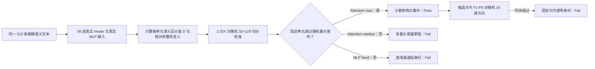

# 粗细语义集中在哪里：真实注意力头还是混合后的固定通道组？

状态：冻结 Qwen3-8B 的 36 层双站点审计已完成；正式裁定为“attention 稀疏最大值 Pass，典型头、MLP 固定组与头内八频带 Fail”。

## 1. 本次回答的问题

**问题：** 粗粒度领域与领域内细粒度概念的区分，是否特别集中在少数 `o_proj` 前真实注意力头，而不是均匀分布或集中在进入 MLP 的固定连续通道组？

**对象：**每层 attention 输出按架构 reshape 为 32 个真实 heads×128 维；同层真正进入 MLP 的 4096 维表征按原生顺序切成 G1--G32。G 组只是同形状分析坐标，不是注意力头。

## 2. 认识更新

**一句话回答：** 少数真实注意力头对粗、细语义具有超出随机切分的高区分度，但多数头没有普遍优势；经过 `o_proj`、残差与 RMSNorm 后，MLP 输入的固定连续组也不比随机分组特殊。

“区分度”是类别中心之间的方差除以同一类别因模板和事实变化产生的方差；数值越高，语义差异相对措辞噪声越清楚。“集中优势” $C=\log(D_{unit}/D_{full})$ 比较一个 128 维单元与完整 4096 维状态，$e^C$ 是区分度倍数；它不是准确率、loss 或因果功能。

1. Attention 的粗、细和细相对粗最大 $C$ 均超过 1,024 次随机 32×128 切分的全局最大 q95，并通过层级 bootstrap；因此少数真实头集中成立。
2. Attention 中位 $C$ 三项均未通过；“真实头中有稀疏峰值”不等于“单头通常比完整表征更强”。
3. MLP 固定组的三个最大值均低于随机最大 q95；它们含有真实语义信号，但连续通道编号没有获得特殊功能身份。
4. 原始语义能量在 attention 头间高度不均，而 MLP 组接近均匀；这描述 `o_proj` 前的分配，不能单独代表最终输出贡献。
5. 每个 128 维单元内的 F1=head、F2--F5=middle、F6--F8=tail 均未超过随机 16 维方向；当前支持“稀疏头身份”，不支持“固定头内谱带身份”。

## 3. 决定性证据

| 主指标 | Attention fixed / random q95 | MLP fixed / random q95 | 回答 |
| --- | ---: | ---: | --- |
| 粗语义最大 $C$ | 3.221 / 1.216 | 0.877 / 0.965 | 仅少数真实头通过 |
| 细语义最大 $C$ | 1.045 / 0.589 | 0.624 / 0.732 | 仅少数真实头通过 |
| 细相对粗最大 $C$ | 2.544 / 1.408 | 0.945 / 1.106 | 仅少数真实头通过 |
| 粗/细/相对中位 $C$ | -0.022/-0.067/-0.026 | -0.003/-0.013/-0.007 | 无普遍单元优势 |

左面板 median 回答“典型单元”，右面板 maximum 回答“最强少数单元”；纵轴正值表示 attention 在扣除本站点随机切分 q95 后仍更集中。只有 maximum 三项区间都高于零，故结论是稀疏专门化而非普遍优势。

## 4. 判断流程图

## 5. 边界与唯一下一决策

- **成立范围：**一个冻结 Qwen3-8B、一个平衡无标签泄漏的 8×8 英文学术 taxonomy、统一冒号读取位置、独立 DCLM covariance；没有模型训练。
- **不能声称：**通过头因果计算语义；同编号头跨层/模型同功能；MLP 没有语义；F1--F8 可直接做 Router；该坐标改善专家效用或训练效率。
- **最强 rival：**稀疏峰值可能只对当前 taxonomy 和 prompt 成立，换一套概念后最佳层/头可能改变。
- **唯一下一决策：**是否在一套概念不重叠、同样平衡且无标签泄漏的 taxonomy 上复现 selection-corrected attention 最大值，并要求通过单元的层/头身份超过随机重合。
- **完成判据：**粗或细至少一项再次超过全局随机最大 q95、bootstrap 下界为正，且跨 taxonomy 的候选坐标重合超过随机；通过后才进入专家反事实效用测试。
- **恢复时第一动作：**冻结新 taxonomy 与跨 taxonomy 头身份指标，不启动 Router 联合训练。
