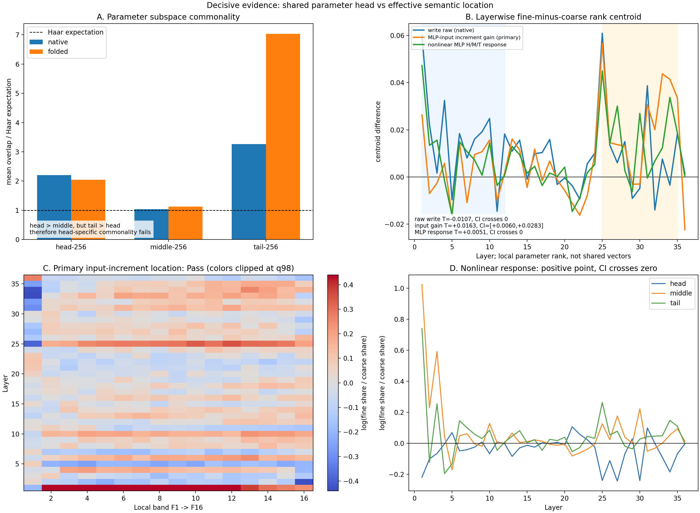
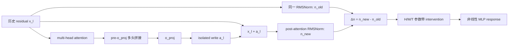
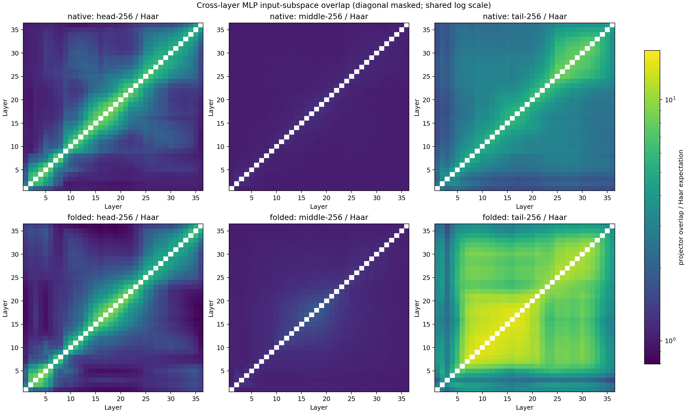
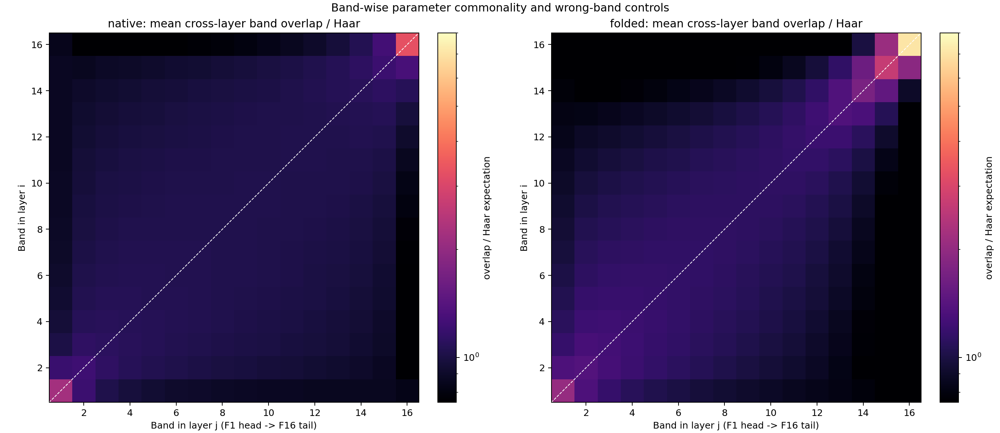
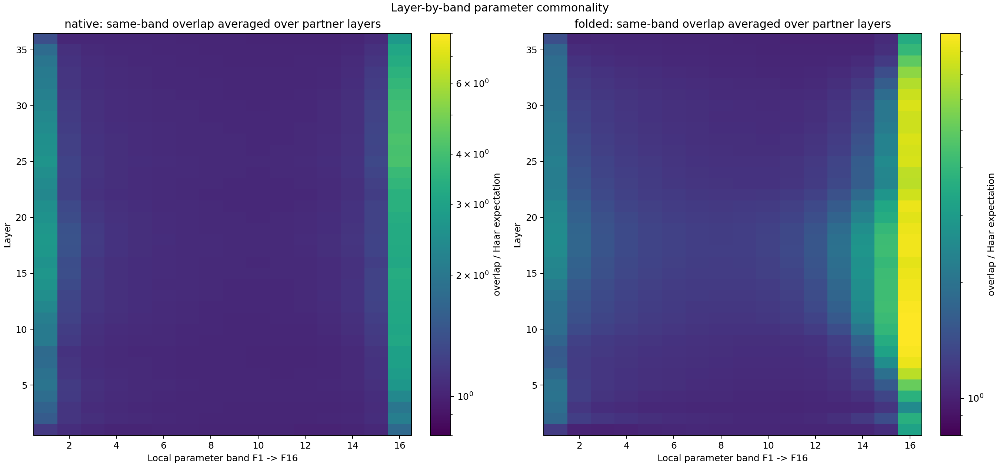
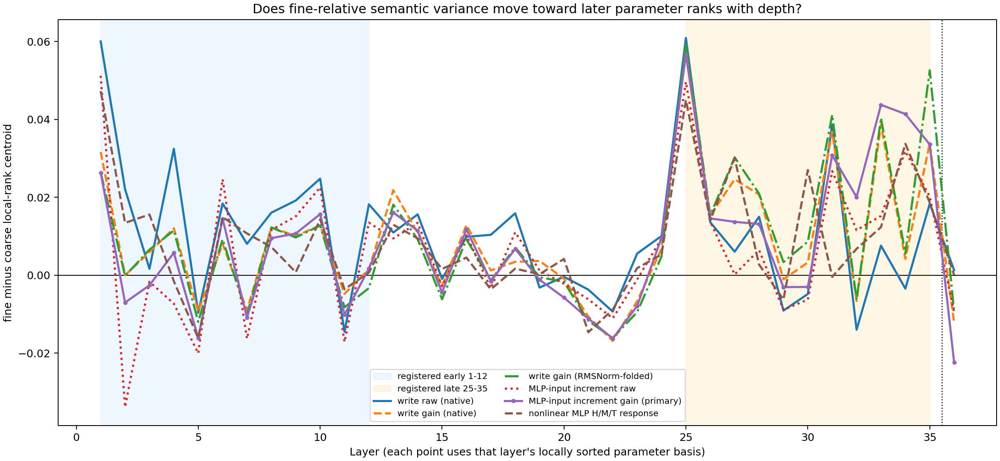
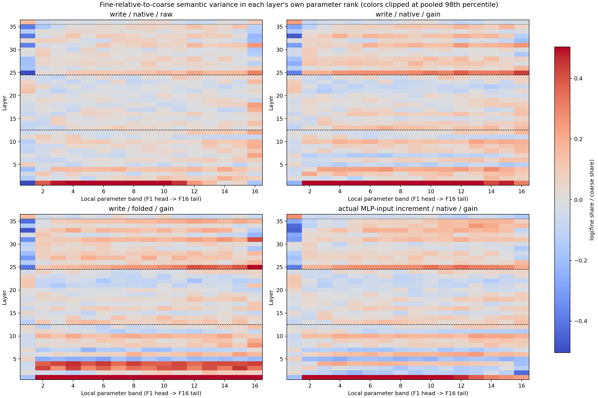
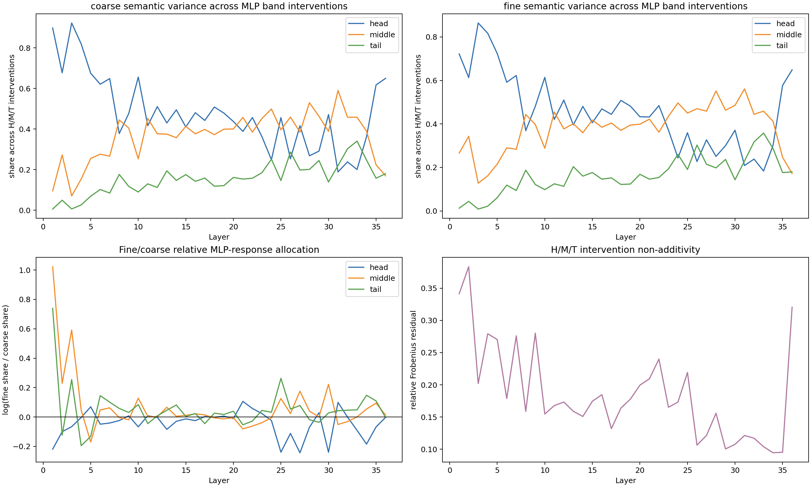
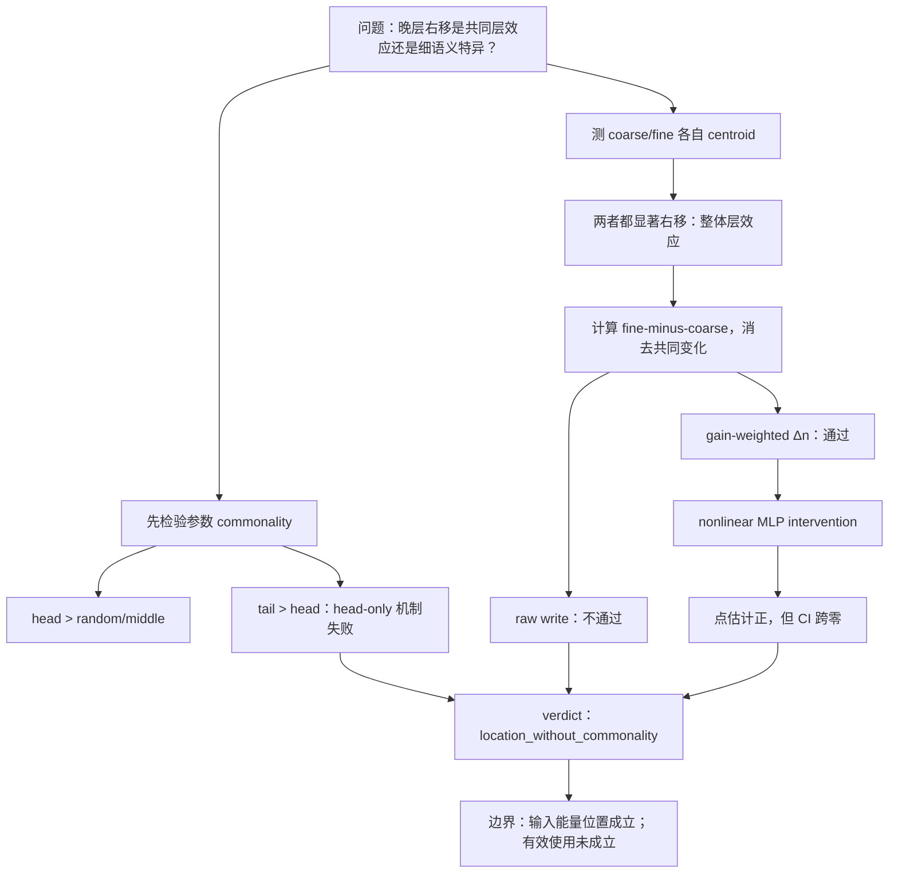

# Qwen3-8B：MLP 参数共同性与粗细语义逐层谱位置审计

## 0. 结论先行

本实验对“方差逐层向右移动”给出了一个必须拆开的答案：

1. **整体右移存在。**从 blocks 1--12 到 25--35，粗、细语义的 `post-o_proj` raw-write 本层参数秩重心分别从 0.342→0.479、0.353→0.470；实际 MLP 输入增量和非线性 MLP 响应也呈现同方向的整体重分配。
2. **raw 右移不是细粒度特异现象。**扣除粗、细共同的层效应后，raw write 的“细减粗”右移量为 -0.0107，95% 区间跨零。细语义没有比粗语义额外向后移动。
3. **参数增益揭示一个较窄的正现象。**在实际 MLP 输入增量 $\Delta n$ 上乘入参数增益后，“细减粗”晚层增量为 +0.01630，约 66.8 个本层秩，95% 区间 [0.00599, 0.02833]；但非线性 MLP 响应区间仍跨零。因此它是可靠的输入能量位置诊断，不是已确认的有效使用。
4. **“common 只在参数 head”被反例推翻。**head-256 的确比随机和 middle 更共享，但 tail-256 更共享；native H/M/T 的跨层重合为随机期望的 2.20/1.04/3.26 倍，折叠 RMSNorm 后为 2.05/1.13/7.04 倍。正确图像是 U-shaped commonality，而不是 head-only commonality。

注册 verdict 为 **`location_without_commonality`**，同时 nonlinear effective-use clause 为 Fail。



## 1. 我们这次确切问什么

唯一问题是：

> 晚层是否把粗、细语义方差更多放到本层 MLP 参数谱的较后秩？这种逐层右移是粗细共享的层效应，还是细粒度额外右移？它能否从 attention write 一直保留到实际 MLP 输入和非线性响应？

这里同时审核一个机制前提：MLP 的高增益参数 head 是否比 middle/tail 更跨层共享。

本实验不研究三级 taxonomy、关系组合深度、词频、稀有知识或 Router utility。0807 的三级关系草稿仍然封存为后续候选，不进入本轮数据。

## 2. 为什么要把导师的“向右”拆成两个命题

### 2.1 整体右移

对同一个语义角色 $g$，比较它在早层和晚层的本层参数秩重心：

$$
median_{late}C_{\ell,g}-median_{early}C_{\ell,g}.
$$

它回答：“晚层是否把这个角色的方差更多分配到自己参数谱的后部？”

### 2.2 细粒度额外右移

再比较 fine 与 coarse 的重心差：

$$
T=median_{late}(C_{fine}-C_{coarse})-median_{early}(C_{fine}-C_{coarse}).
$$

它先减掉粗、细共享的层变化，回答：“细粒度是否比粗粒度额外向右？”这才是公平的粗细对照。

因此，导师说“晚层谱向右”可能只意味着第一个命题；“更复杂/更细语义位于后谱”则需要第二个命题。前者在本实验中清楚存在，后者只在增益加权的 $\Delta n$ 上成立，raw 和 nonlinear 两端都没有完成证据链。

## 3. 横轴到底是什么

本轮横轴是**参数谱**，不是 0805/0806 报告使用的 DCLM activation-covariance 数据谱。每层构造

$$
K_\ell=W_{gate,\ell}^{T}W_{gate,\ell}+W_{up,\ell}^{T}W_{up,\ell}
=V_\ell\Gamma_\ell V_\ell^{T}.
$$

从大到小排列 $\Gamma_\ell$，把 4096 个本层方向分成 16 个 256 维 band：F1 为 head，F2--F8 为 middle，F9--F16 为 tail。

必须强调：

- layer 5 的 rank 500 与 layer 30 的 rank 500 不是同一个向量；
- 折线图比较的是每层自身的 rank percentile 分布；
- 真正的跨层方向共同性由投影子空间重合 $tr(P_\ell P_m)/r$ 单独测量；
- 所以“逐层右移”是各层局部坐标中的分配规律，不是向量从左边移动到右边。

## 4. 两个表征位置与实际计算链



本轮主表征是：

1. **`post-o_proj` isolated write $a_\ell$：**本层 attention 分支直接写出的量，加 residual 之前；它依赖历史状态，不能称为纯新信息。
2. **实际 MLP 输入增量 $\Delta n_\ell$：**精确包含 residual sum 和层特异 RMSNorm 对本层写入的转换。

`pre-o_proj` 多头拼接已经在 0805 报告中完整审计；它不在 MLP 输入坐标中，因此本轮不重复抽取，只作为架构位置背景。

## 5. 为什么不能直接把 post-o_proj write 投到原始参数方向就结束

原始 $K_\ell$ 的右奇异方向属于 RMSNorm 后的 MLP 输入坐标，而 $a_\ell$ 属于 residual 坐标。两者中间有层特异 RMSNorm 权重和样本相关的归一化半径。

因此我们报告三层证据：

1. **raw geometry：**$a_\ell$ 在 native 参数方向中的方差位置，保留直观诊断；
2. **coordinate/gain control：**把 RMSNorm 权重折进 $K_\ell^{eff}=D_\ell K_\ell D_\ell$，并乘特征值；
3. **actual input and response：**直接计算 $\Delta n_\ell$，再测 native 参数增益和 MLP 非线性 band intervention。

如果 raw tail 富集而后两层消失，只能说几何上存在，不能说 MLP 有效使用。当前实际结果恰好相反：raw fine-specific 右移不成立，gain-weighted input 成立，nonlinear response 未确认。

## 6. 数据如何构造

完全复用经过审核的 512 条平衡数据，不新增数据代码：

```text
8 个 parent
× 每个 parent 8 个 child
× 每个 child 4 个模板
× 每个模板 2 个 fact bundle
= 512 条文本
```

八个 parent 是 mathematics、physics、chemistry、biology、computer science、economics、medicine、linguistics。以 mathematics 为例，八个 child 是 algebra、analysis、combinatorics、geometry、number theory、probability、statistics、topology。

一个真实样本为：

> Topic description: This topic studies symbolic expressions and equations with unknown quantities; it also uses abstract operations satisfying closure and inverse properties; a central concern is structure-preserving maps between formal systems. Identify the broad academic field and the specific subfield. Classification:

标签 `mathematics` 和 `algebra` 不出现在描述正文。四个模板中 1--2 为 design，3--4 为 confirmation；每个 parent-child 在两侧各有 4 条。自然长度 41--58 tokens，中位数 49；统一在最后的 `Classification:` 冒号读出。

冻结数据标识：`cb440b98d81bac3f9813344f85e6efdbd994b7b988d8009ba64e207e64a11859`。

## 7. 不同语义节点怎么测试

对状态 $z_{pcet}$：

- **粗节点 covariance：**先对同一 parent 内所有 child、模板和 bundle 求均值，再计算 8 个 parent center 的 covariance；
- **细节点 covariance：**先在每个 child 内跨模板/bundle 求均值，再在同一 parent 的 8 个 child 之间计算 covariance，最后平均 8 个 parent；
- **共同表达噪声：**同一个 child 内模板/bundle 的 covariance，只用于可靠性，不为 coarse/fine 各造一个不同分母。

粗、细的类别数都是 8-way，样本完全平衡；使用 population weighting 后，类别数和样本数不会机械改变主位置统计量。频谱比较用每个角色自身总类别间方差归一化后的 share：

$$
L_{\ell k}=\log\frac{p_{\ell,fine,k}}{p_{\ell,coarse,k}}.
$$

红色表示 fine 相对自己的总方差，比 coarse 分给该 band 更多；它不表示 fine 的绝对方差更大。

## 8. 参数共同性结果：不是 head-only，而是 U 形

同维随机子空间的预期重合为 $256/4096=0.0625$。所有 630 个跨层 pair 的均值为：

| 参数对象 | head-256 / random | middle-256 / random | tail-256 / random |
| --- | ---: | ---: | ---: |
| native $K$ | 2.199 | 1.041 | 3.263 |
| RMSNorm-folded $K^{eff}$ | 2.047 | 1.127 | 7.036 |

head 显著高于 middle，但 tail 显著高于 head；128/256/512 三种等秩宽度都保持这个顺序。即使只看层距至少 18 的 pair，native H/M/T 仍是 1.22/1.02/2.32，folded 为 1.23/1.05/4.83。



16×16 bandwise 图同时给出 wrong-band controls：亮的 F1/F16 对角端点说明同秩 head/tail 共同性，非对角结构说明相邻谱带也有旋转/混合，不能把单个 eigenvector 当成固定身份。





正确认识更新是：**存在共享高增益 head，也存在更强的共享低增益 tail；common subspace 不能等同于语义 common，更不能只看 head。**共享 tail 可能是共同 near-null geometry，本实验没有识别其语义功能。

## 9. 逐层方差曲线：整体右移很强，细粒度额外右移很弱

### 9.1 整体层效应

| 位置/加权 | coarse early→late | fine early→late |
| --- | ---: | ---: |
| write native raw | 0.342→0.479 | 0.353→0.470 |
| write native gain | 0.134→0.303 | 0.125→0.302 |
| actual $\Delta n$ raw | 0.370→0.480 | 0.370→0.471 |
| actual $\Delta n$ gain | 0.115→0.314 | 0.120→0.311 |
| nonlinear H/M/T response | 0.159→0.309 | 0.172→0.317 |

所以“晚层整体向本层 tail 方向移动”是可直观看到的。但 coarse 和 fine 同时发生，不能由此推出“复杂语义在 tail”。

### 9.2 扣除共同层效应后的细粒度增量

| 统计量 | $T$ | 95% 区间 | 判定 |
| --- | ---: | ---: | --- |
| raw write / native | -0.01071 | [-0.01784, 0.00447] | Fail |
| gain write / native | +0.01371 | [-0.00072, 0.01950] | Fail |
| gain write / folded | +0.01306 | [0.00165, 0.02301] | Pass |
| actual $\Delta n$ / raw | +0.00880 | [-0.00267, 0.01684] | Fail |
| actual $\Delta n$ / gain | +0.01630 | [0.00599, 0.02833] | Primary Pass |
| nonlinear MLP H/M/T | +0.00514 | [-0.00298, 0.01620] | Fail |

主统计量还通过 design/confirmation、8/8 leave-one-parent、128/256/512 宽度。它说明参数线性增益下，晚层的细语义相对粗语义多分配约 1.63% 的谱秩百分位；它不说明 MLP 非线性最终稳定使用该差异。





### 9.3 十层逐方向曲线

下图选取 blocks 1、5、9、13、17、21、25、29、33、36。横轴保留每层本地参数谱的全部 4096 个方向；纵轴是 coarse/fine 类别中心方差的 $\log_{10}$ 值，再用 129-rank、三阶 Savitzky--Golay 滤波平滑。颜色由浅到深对应模型层由浅到深；没有做谱带平均或跨层平均。


**如何读图：**晚层曲线整体更高，首先说明 raw 类别中心方差的数值尺度随深度增大；曲线在本地秩上的形状仅作补充描述。由于不同层使用不同参数基底，而且图中没有按每层总方差归一化，该图不能单独证明横向右移，也不能证明 fine 比 coarse 额外右移；这两个判断仍分别由秩重心 $C_{\ell,g}$ 和 fine-minus-coarse 的早晚差决定。

## 10. 实际 MLP 响应

对 H=F1、M=F2--F8、T=F9--F16，分别只加入该 band 的 $\Delta n$ 再运行 MLP。晚层 coarse/fine 响应的 H/M/T 中位 share 约为 0.292/0.458/0.220 与 0.300/0.459/0.230；相对差异小，注册细减粗 response shift 的区间跨零。



H/M/T 响应相加与 full response 的中位相对残差是 0.170，说明非线性交互不可忽略。因此不能把 H/M/T 三条响应当成严格方差分解。

## 11. 与学长实验、0805/0806 报告的区别

### 11.1 学长实验

学长使用 Qwen3-0.6B、MLP-input SAE、layers 3/14/26，并比较 constituent-exclusive 与 composite-exclusive feature population；先画 SAE feature decoder 在参数谱的 raw 方差，再乘奇异值平方看 transmitted variance。

本轮继承了“raw 与 gain 必须分开”的核心思路，但更换了研究对象：

- 使用平衡 coarse/conditional-fine 类别 covariance，而不是数量不等的 SAE role population；
- 使用 Qwen3-8B 的 36 层；
- 同时测 post-o_proj write、精确 $\Delta n$ 和 nonlinear MLP response；
- 用 projector overlap 真正检验跨层 commonality。

所以本轮不是学长实验的 replication，而是对其参数坐标解释进行公平的粗细语义审核。

### 11.2 0805/0806 报告

0805/0806 的横轴是每层 DCLM activation covariance 排序后的**数据谱**，回答“语义方差相对自然数据常见变动位于哪里”。本轮横轴是 MLP gate/up 的**参数谱**，回答“attention 写入相对 MLP 输入增益方向位于哪里”。两者不是同一个谱，也不能直接对齐第 500 个方向。

## 12. 导师问题的确切回答

若导师的“谱向右移动”指：

> 晚层语义方差在每层自身的局部谱秩中更靠后，

那么当前参数谱实验给出清晰的 descriptive Yes，而且 coarse/fine 都有。

若导师的意思是：

> 细粒度或更复杂语义比粗粒度额外向后，且 MLP 有效使用它，

那么当前答案是 Partial：raw write 不成立；gain-weighted actual input 成立；nonlinear MLP response 尚未成立。

因此正确现象不是“一条语义曲线随层深向右平移”，而是：

```text
强的共同层效应：coarse 与 fine 都向本层后秩重分配
                +
较小的粒度差异：只在 gain-weighted Δn 中稳定
                +
尚缺的功能闭环：nonlinear MLP response 未过区间门
```

## 13. 认识更新流程图



## 14. 与导师的讲解顺序

建议按 7 步讲，不从公式开始：

1. **一句话问题：**我们要区分“整体逐层右移”和“细粒度额外右移”。
2. **先澄清横轴：**每层自己的 MLP 参数秩；不是跨层同一个 direction，也不是 0805/0806 的数据谱。
3. **展示 Figure 0A：**head 比 middle common，但 tail 更 common，原来的 head-only common 假设被反例纠正。
4. **展示 Figure 0B：**coarse/fine 都有强整体右移；raw fine-minus-coarse 没有额外右移。
5. **展示 Figure 0C：**RMSNorm 后实际 $\Delta n$ 经参数增益出现 +66.8 ranks 的稳定细粒度额外右移。
6. **展示 Figure 0D：**非线性 MLP response 区间跨零，因此不能说有效使用，也不能进入 Router。
7. **请导师确认唯一下一决策：**是否只做一次独立 taxonomy replication，并把 nonlinear response 的正下界作为继续机制/功能实验的 admission gate。

导师可能追问时再打开 Figure 1b/1c（U-shaped parameter commonality）、Figure 2（layer×band 细/粗热力图）和 Figure 4（H/M/T response 与 0.170 non-additivity）。

## 15. Claim Boundary 与唯一下一决策

当前可以说：晚层的 coarse/fine attention write、MLP-input increment 和 MLP response 都在本层参数秩中整体后移；gain-weighted actual input 存在稳定的 fine-relative shift；参数 commonality 是 U 形。

当前不能说：细语义 raw 地位于 middle/tail、common 只等于 head、词频导致该现象、tail 是稀有/高级知识、MLP 非线性有效使用该位置、或它能指导 Router。

**唯一下一决策：**是否在一个独立、同样平衡且无标签泄漏的 taxonomy 上复现 $T_{\Delta n,gain}$，并把 $T_{MLP}$ 的 95% 下界 >0 设为功能实验 admission gate。若任一项失败，关闭 fine-specific effective-location 机制，只保留“共同逐层重分配 + U-shaped 参数共同性”的描述性结论。

## 16. 执行与证据位置

- smoke `om-ltgmx70x`，P `om-zn6g16x8`，S `om-fnauw0g7`，R `om-dph5vhje`；均 `SUCCEEDED`、零重试。
- 资源均为单节点 8×5090 SPOT，`n12lp.nn.i10a.8`。
- Canonical [Protocol](../../source_records/mlp_parameter/protocol.md)、[Summary](../../source_records/mlp_parameter/summary.md)、[Detailed](../../source_records/mlp_parameter/detailed.md)。
- 完整数表见 [layerwise centroids](tables/layerwise_centroids.csv) 与 [parameter commonality](tables/parameter_commonality.csv)。
