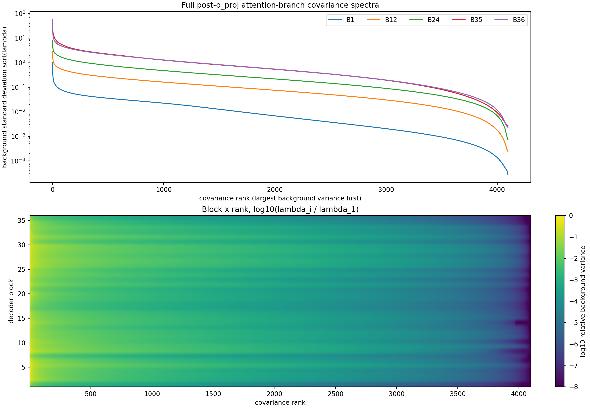
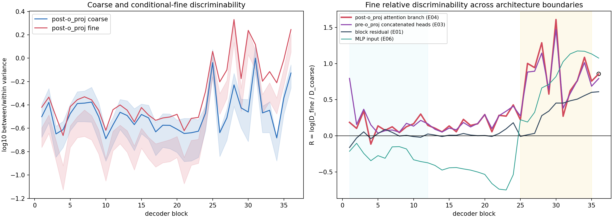
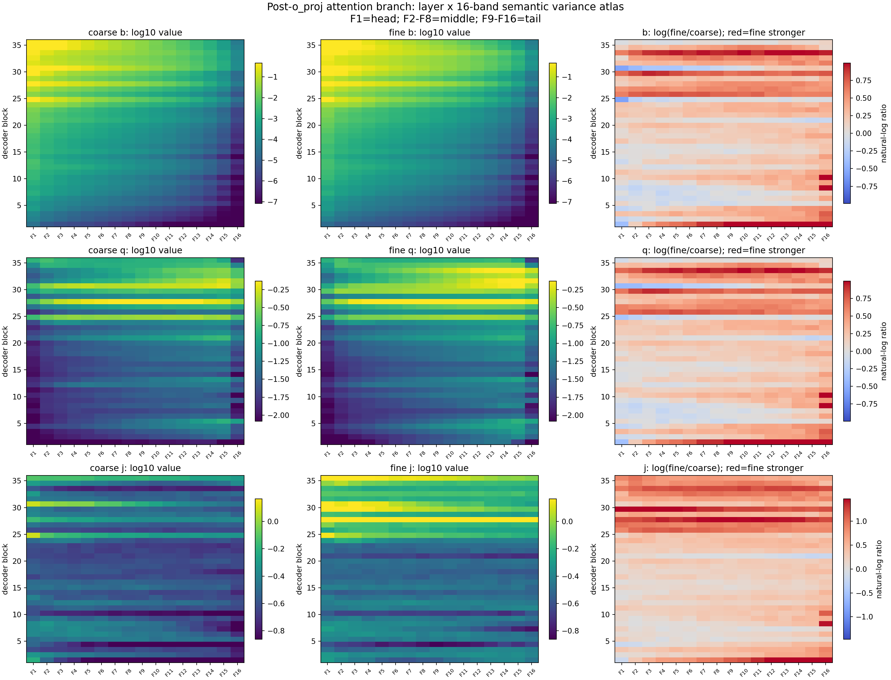
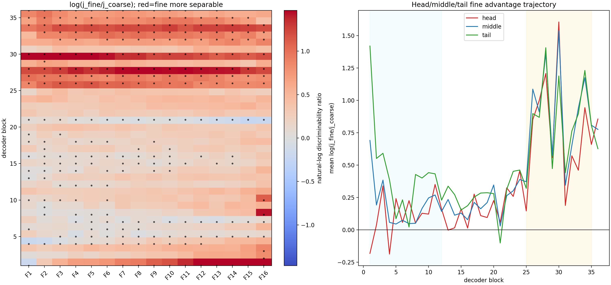

# Qwen3-8B post-`o_proj` 完整 Attention 语义粒度方差画像

## 摘要

本实验回答一个确定问题：Qwen3-8B 的 32 个注意力头经过输出投影 `o_proj` 混合后、尚未与 residual 相加时，晚层是否仍比早层更清楚地区分同一粗类内部的细语义，以及这类差异落在自然文本 covariance 谱的哪些位置。

结论是：**深度效应通过，联合频谱命题失败。** 细语义相对粗语义的区分度从早层的 1.14 倍上升到晚层的 2.14 倍，最后一层达到 2.36 倍，没有反转。粗、细语义的实际类别间方差在 blocks 1--35 始终以第一谱带 F1 最大。相对各自总语义方差，细语义在 middle 多分配约 6.5%，该小效应通过本实验的局部随机与稳定性对照；tail 虽多约 17.2%，但未通过独立 calibration-half 基底稳定性门。因此，本实验说明 `o_proj` 没有抹去晚层细语义增强，并伴随小幅 middle 相对份额变化；它没有建立固定 non-head 路由坐标。

## 1. 为什么补测 post-`o_proj`

此前测量了两个不同对象：

1. `o_proj` 之前，32 个注意力头输出直接拼接得到的 4096 维向量；
2. residual 合并并归一化后的 MLP 输入。

它们之间缺少一个重要边界：32 个头已经由 `o_proj` 线性混合、但还没有混入 residual 的完整 attention branch。若只比较前后两个远端位置，就无法知道细语义信号是否跨过了跨头混合。E04 因此捕获：

$$
a_\ell=\operatorname{Concat}(head_1,\ldots,head_{32}),
\qquad
g_\ell=W_{O,\ell}a_\ell,
$$

其中 $g_\ell$ 就是本实验的 post-`o_proj` 表征。

## 2. 固定模型与数据

模型固定为本地 `/data/share/Qwen3-8B`：36 个 decoder blocks、hidden size 4096、32 个 query heads；权重全程冻结，bfloat16 前向，不进行微调。

语义数据完全复用既有平衡数据立方：

- 8 个粗粒度父类；
- 每个父类 8 个细粒度子类；
- 每个子类 4 个模板、2 个互不重叠的事实包；
- 总计 $8\times8\times4\times2=512$ 条无标签泄漏英文描述；
- 所有序列读取同一个最终 `Classification:` 冒号 token，绝对位置为 57。

这里“粗语义”是跨父类的区别；“细语义”是同一父类内部 8 个子类的区别。实际文本、token ids、层级标签、模板、事实包和读出位置见 [actual_semantic_text_sequences.json](../../source_records/post_o_proj/actual_semantic_text_sequences.json)。语义数据 SHA-256 为 `cb440b98d81bac3f9813344f85e6efdbd994b7b988d8009ba64e207e64a11859`。

自然背景 covariance 使用独立的 128 篇 DCLM 文档、每篇 512 token，共 65,536 token，并固定两个 calibration half。来源与顺序见 [calibration_manifest.json](../../source_records/post_o_proj/calibration_manifest.json)。本次抽取张量 SHA-256 为 `d88620267dbdc9c2b87ec24c2f51d9e6fb317cb8c051ec96503414ea9bff60b9`。

## 3. 测量什么

### 3.1 语义区分度

类别间方差 $B$ 表示不同类别中心相隔多远；类别内方差 $W$ 表示同一类别因模板和事实表述变化而散开多远。区分度定义为

$$
D=\frac{\operatorname{tr}(B)}{\operatorname{tr}(W)+\epsilon}.
$$

$D$ 大，表示“类中心远、同类样本紧”，因此类别更容易区分；它不是分类准确率，也不是 Router 效用。

同层细粗比较为

$$
R_\ell=\log\frac{D_{\ell,fine}}{D_{\ell,coarse}}.
$$

$R>0$ 表示细语义相对粗语义更可分。主深度差分是 blocks 25--35 的 $R$ 中位数减 blocks 1--12 的中位数；block 36 单独报告。

### 3.2 自然背景频谱

每层用独立自然文本拟合

$$
\Sigma_\ell=U_\ell\Lambda_\ell U_\ell^\top.
$$

4096 个方向按背景方差从大到小排列并划成 16 个等秩 256 维带：F1=head，F2--F8=middle，F9--F16=tail。

本实验同时区分四类量：

- $b$：每方向实际类别间方差，保留背景大奇异值的能量优势；
- $q$：相对自然背景方差归一化的语义方差；
- $j$：该频带内部的类别间/类别内区分度；
- $e$：该带实际语义方差相对该语义全谱平均的份额，用来比较粗、细语义怎样分配自身的方差。

因此，“middle 的 $e$ 更高”只表示细语义把自身总方差的稍大比例分给 middle，不表示 middle 的绝对能量超过 head。

图中横轴是按背景方差从大到小排列的归一化方向 rank，纵轴是该方向的 covariance 特征值；越靠左、曲线越高，表示自然文本在该方向上的背景变化越大。该图定义频带坐标，但不能告诉我们某方向编码什么语义。

## 4. 执行与有效性门

代码复用 E03 的数据、moment、bootstrap、随机方向、half-split、特征值 floor 和绘图链，只把 hook 从 `o_proj` 输入移动到输出。

正式作业 `om-5y1d8uf1` 使用 SCO ACP 单节点 8×5090 SPOT，终态 `SUCCEEDED`、零重试。第一次作业 `om-1hc00w00` 因诊断代码改变 bfloat16 矩阵乘法 shape 而在 smoke 停止，属于无效工程记录；只修复 full-shape replay guard 后重跑，科学条件未变。

正式守卫结果：

| 有效性门 | 结果 |
| --- | ---: |
| post-`o_proj` 模块输出与直接 $W_Oa$ replay | 绝对误差 0，相对误差 0 |
| FP32 Gram 与直接 FP64 最大相对误差 | $7.22\times10^{-8}$ |
| 模型层覆盖 | 36/36 |
| 语义记录 | 512/512 |
| calibration token | 65,536/65,536 |
| covariance 重建、能量守恒、half-split | 全部通过 |
| 4 个模板、8 次父类留一 | 全部同向 |

## 5. 结果一：晚层细语义增强跨过了 `o_proj`

| 位置 | 早层 $R$ | 晚层 $R$ | 早晚差分 $T$ | block 35 | block 36 |
| --- | ---: | ---: | ---: | ---: | ---: |
| post-`o_proj` | 0.131 | 0.762 | 0.631 | 0.757 | 0.857 |
| pre-`o_proj` | 0.153 | 0.764 | 0.611 | 0.686 | 0.792 |
| block residual | 0.001 | 0.452 | 0.451 | 0.601 | 0.609 |
| MLP input | -0.260 | 0.819 | 1.079 | 1.133 | 1.075 |

post-`o_proj` 主差分 $T=0.631$，95% 区间 [0.553, 1.148]。早层 $e^R=1.14$，表示细语义区分度约为粗语义的 1.14 倍；晚层为 2.14 倍。blocks 35/36 分别为 2.13/2.36 倍，最后一层没有单独反转。

图中横轴是 block 编号，纵轴是 $R=\log(D_{fine}/D_{coarse})$；曲线越高，表示细语义相对粗语义越清楚。阴影表示按父类、子类和模板层级重采样的区间。pre/post 曲线几乎重合，说明细语义增强在 `o_proj` 两侧均可观察；这不是 `o_proj` 的因果零效应，因为各位置没有做 matched intervention。

## 6. 结果二：实际能量仍由 F1 主导，middle 出现小幅相对富集

粗、细语义的实际类别间方差 $b$ 在 blocks 1--35 的 16 个频带中始终以 F1 最大。也就是说，无论语义粒度，绝对语义能量仍主要落在自然文本的大方差方向。

晚层细语义相对粗语义的相对实际方差份额为：

| 频谱组 | 对数富集 | 95% 区间 | 直观含义 | 裁定 |
| --- | ---: | ---: | --- | --- |
| Head, F1 | -0.106 | [-0.165,-0.064] | 细语义相对份额少约 10.0% | 描述性 depletion |
| Middle, F2--F8 | +0.063 | [0.053,0.108] | 细语义相对份额多约 6.5% | 局部 Pass |
| Tail, F9--F16 | +0.159 | [0.135,0.249] | 细语义相对份额多约 17.2% | Fail：独立半集基底不稳定 |

同维随机方向的晚层 q95 为 0.059。middle 的 0.063 只略高于该阈值，但同时通过了 design/confirmation 模板、两个 calibration-half 基底、干扰变量残差化和三个 eigenvalue floor，因此本实验允许报告一个小幅 middle 相对富集。tail 数值更大，却在独立半集基底的至少一个晚层改变方向，所以不能报告为稳定坐标。

热图横轴是 F1--F16，越向右背景方差越小；纵轴是 block 1--36。第一行显示实际类别间方差 $b$，颜色越亮表示该频带每个方向承载的绝对类别中心差异越大；第二行是背景归一化 $q$；第三行是频带内区分度 $j=B/W$。色条数值只在同一面板定义下比较，不可跨指标直接比大小。

上图把粗、细的 $j$ 以及细减粗轨迹放在一起。晚层红色区域广泛跨越多个频带，说明“细语义相对更可分”不是由一个孤立频带独占；黑点表示单元格配对区间不跨零，但最终频谱裁定仍必须通过随机方向、half-split、模板和 floor 的组级门。

## 7. Decisive 认识更新

1. **晚层细语义相对区分度增强并不是 residual/MLP 才出现的，它在 pre-`o_proj` 已存在，并完整跨过 `o_proj`。**
2. **`o_proj` 后粗、细语义的绝对差异仍主要由 F1 承担，因此不能说细语义已经迁移到谱尾。**
3. **细语义在 post-`o_proj` middle 中有约 6.5% 的相对份额富集；这是相对方差分配的小效应，不是绝对能量主导，也不是 Router 效用。**
4. **tail 富集没有跨独立自然语料半集稳定复现，因此联合“固定 non-head 坐标”命题失败。**
5. **pre/post/residual/MLP 都显示晚层细语义增强，但仅凭静态站点比较不能判断哪个模块因果产生或放大该信号。**

## 8. 对 Router 设计的边界

本实验只建立表征画像。它不能证明：

- `o_proj` 因果创造 middle 富集；
- 深层执行了组合计算；
- middle 能预测哪个专家最适合 token；
- 固定 middle 路由能降低专家内梯度冲突；
- 频谱路由能改善 held-out loss/FLOP。

若要把 middle 变成 Router 候选，最小下一步不是直接训练，而是先在独立、平衡、无标签泄漏的 taxonomy 中同时复现：post-`o_proj` 的正深度差分和晚层 middle 相对富集。复现后才进入专家反事实效用或共同训练兼容性准入。

## 9. 完整证据入口

- [正式 Protocol](../../source_records/post_o_proj/protocol_cn.md)
- [中文结果摘要](../../source_records/post_o_proj/summary_cn.md)
- [完整证据账本](../../source_records/post_o_proj/detailed.md)
- [完整表格目录](tables/)
- [typed verdict](../../source_records/post_o_proj/verdict.json)
