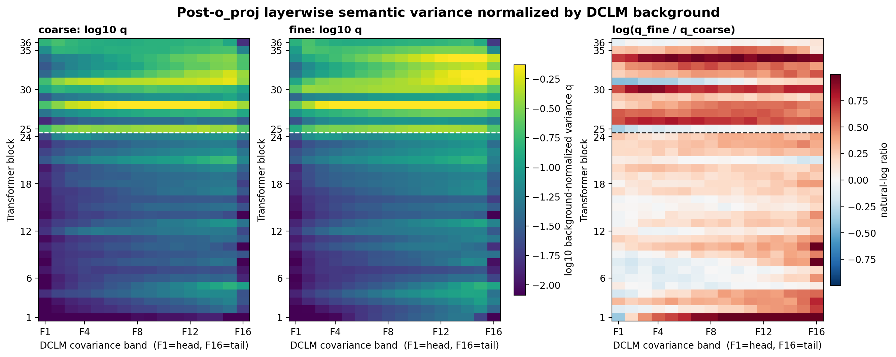
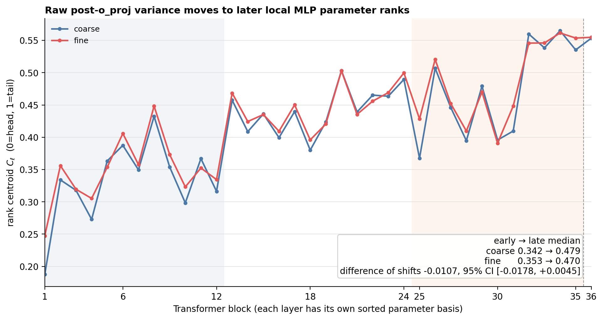
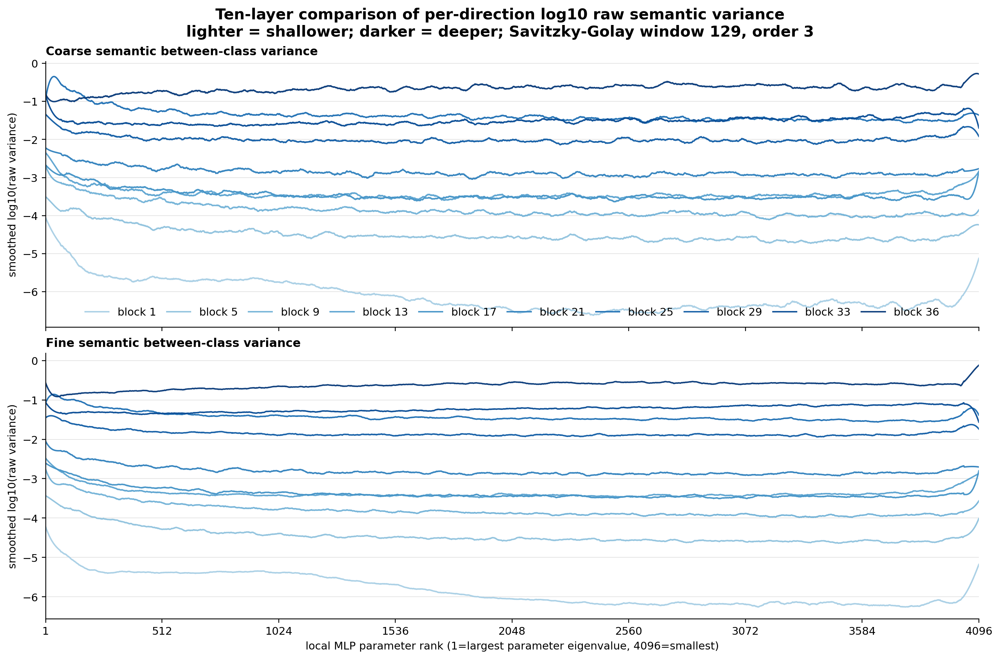
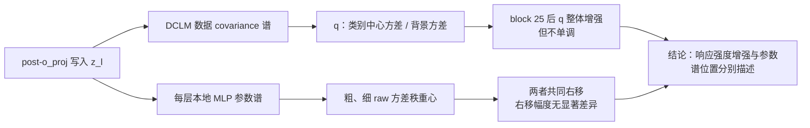

# Block 25 后背景归一化语义方差增强，粗细参数谱响应共同右移

## 1. 本次回答的问题

冻结 Qwen3-8B，在每个 block 读取未加 residual 的完整注意力写入
$z_\ell=W^O_\ell\operatorname{Concat}(head_{\ell,1},\ldots,head_{\ell,32})$。数据含 8 个粗粒度父类、每类 8 个细粒度子类、每个子类 8 种模板/事实表达，共 512 条平衡样本。

1. **表征协方差谱：语义方差相对自然背景如何随深度变化？** 每层用独立 DCLM 数据建立表征协方差$\Sigma_\ell^{bg}=U_\ell\Lambda_\ell U_\ell^\top.$将粗、细语义的类别中心协方差投影到该层的数据谱方向，并除以对应背景方差，得到背景归一化语义方差 (q)。我们要判断：随着层数加深，(q) 是否整体增强、从哪一层开始发生明显变化、变化分布在哪些谱带，以及粗、细粒度是否呈现不同的层深轨迹。

2. **MLP 参数谱：语义方差的参数位置是否随深度后移？** 每层用$K_\ell=W_{gate,\ell}^{\top}W_{gate,\ell}+W_{up,\ell}^{\top}W_{up,\ell}=V_\ell\Gamma_\ell V_\ell^\top$定义本层 MLP 参数谱，再将同一 attention write 的粗、细语义方差投影到该谱上。我们要判断：两类语义的方差秩重心是否随深度移向较后的参数秩，以及这种移动是粗、细语义共享的层深效应，还是细粒度语义具有额外右移。

我们只比较两个量。第一，数据谱上的背景归一化语义方差
$q_{\ell,g,k}=|F_k|^{-1}\sum_{i\in F_k}B_{\ell,g,i}/\max(\lambda_{\ell,i},10^{-6}\lambda_{\ell,1})$；其中 $B_{\ell,g,i}$ 是粒度 $g$ 的类别中心方差，$\lambda_{\ell,i}$ 是独立 DCLM 数据在该方向的背景方差，F1--F16 按 $\lambda$ 从大到小排列。第二，MLP 参数谱上的 raw 方差秩重心 $C_{\ell,g}$；$C$ 越大，表示语义方差越靠近本层参数谱的后秩。

## 2. 两条认识更新

1. **从 block 25 开始，粗、细语义的 $q$ 同时进入更高但非单调的晚层区间。** block 24→25 时，16 个谱带的中位 $\log_{10}q$ 在 coarse/fine 上分别增加 $0.764/0.605$；因为 $q$ 已除以 DCLM 背景方差，该现象不只是绝对激活尺度同步变大。$q$ 不含类内方差，因而表示“背景归一化后的类别中心变化增强”，不等同于分类区分度。

2. **粗、细语义在本层 MLP 参数谱上的 raw 响应都总体右移，二者没有显著差异。** 秩重心的早/晚层中位数由 coarse 的 $0.342/0.479$、fine 的 $0.353/0.470$ 给出；两种右移幅度之差为 $-0.0107$，95% 区间 $[-0.0178,+0.0045]$ 跨零。

## 3. 决定性证据

白色虚线标出 block 24→25：此后 coarse 与 fine 的多个谱带整体变亮，但层间仍有明显回落。右图红色表示该层该谱带的 $q_{fine}>q_{coarse}$；它说明细粒度的背景归一化类别中心方差更强，不表示类内样本更集中。

两条曲线随深度共同右移且高度重合；横轴是每层独立排序后的本地参数秩，不是跨层共享的同一组向量。

十层曲线保留全部 4096 个本地参数秩，仅对 $\log_{10}$ 方差作 129-rank 平滑；颜色越深表示层越深。该图显示晚层 raw 方差的整体尺度更大，但不单独用于判断右移，右移仍由归一化秩重心 $C_{\ell,g}$ 决定。

完整 setting 与原始结果见 [post-o_proj 数据谱报告](docs/qwen3_post_o_proj_full_attention_semantic_variance_atlas/report.md) 和 [MLP 参数谱报告](docs/qwen3_mlp_parameter_commonality_attention_write_semantic_location/report.md)。

## 4. 认识更新流程

## 5. Claim boundary 与唯一下一决策

**成立范围：**一个冻结 Qwen3-8B、一个 8×8 平衡 taxonomy、统一读出 token、post-`o_proj` 写入。**不能声称：**$q$ 是分类准确率或类内聚集度、细粒度比粗粒度额外右移、不同层同一 rank 是同一方向、middle/tail 对应复杂或稀有知识，或该坐标可直接指导 Router。

**唯一下一决策：**请导师确认是否冻结本次结论为“block 25 后背景归一化语义方差增强；粗细参数谱响应共同右移且无显著差异”。**完成判据：**导师认可 $q$ 与本地参数秩重心 $C$ 的定义及上述边界。**恢复动作：**确认后，在独立平衡 taxonomy 上只复现 block-25 $q$ 转折与共同右移；若不认可，先重定义测量量，不继续扩数据。
