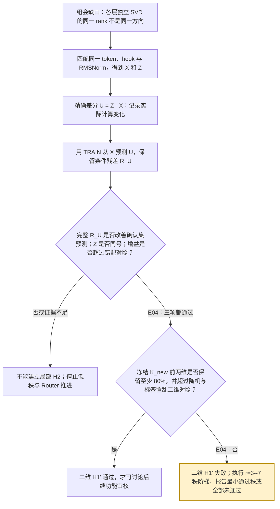
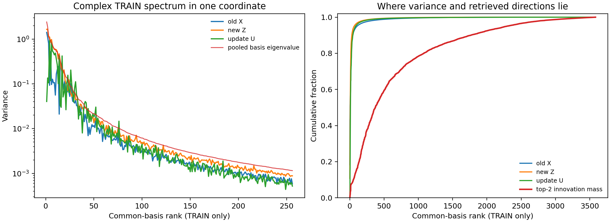
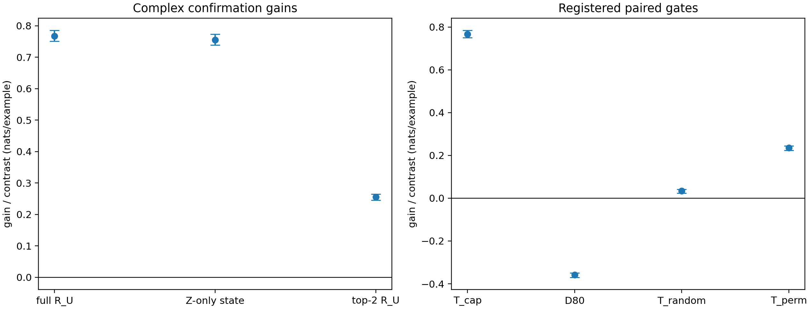

# 如何度量第 25 层注意力模块写入的新增信息？

```text
type: daily_research_report
status: AI_DRAFT_AWAITING_HUMAN_CONFIRMATION
date: 2026-08-10
topic: layer25_conditional_innovation
canonical_anchor: Projects/from-attention-to-search/main/problem_anchors/15_spectral_representation_and_functional_routing/15_08_target_conditioned_layer_innovation/15_08_target_conditioned_layer_innovation_anchor.md
frozen_protocol: Projects/from-attention-to-search/main/experiments/A15/15_08_target_conditioned_layer_innovation/A15_08_E04_strict_conformance_repair/protocol.md
canonical_summary: Projects/from-attention-to-search/main/experiments/A15/15_08_target_conditioned_layer_innovation/A15_08_E04_strict_conformance_repair/summary.md
canonical_detailed: Projects/from-attention-to-search/main/experiments/A15/15_08_target_conditioned_layer_innovation/A15_08_E04_strict_conformance_repair/detailed.md
evidence_completed_utc: 2026-08-11
```

> **外部同步说明：**用户已授权将本读者副本同步到 `kv_cache/xyDeng`；科学
> 表述仍保留源文件状态 `AI_DRAFT_AWAITING_HUMAN_CONFIRMATION`，同步本身不
> 自动升级为研究者确认。私有组会记录与完整原始证据账本未纳入本包。

这里 `canonical` 表示当前事实来源，`frozen` 表示在打开最终确认数据前已经固定。
Anchor 负责问题与结论边界，Protocol 负责预注册检验合同，Summary 是结论入口，
Detailed 是完整证据与复现账本。

## 摘要

组会提出的前置问题不是立刻训练路由器，而是先回答：两层或两次写入之间的
差，怎样才可以被称为“新增信息”？本报告把这个问题缩成一个可检验实例：在
冻结 Qwen3-8B 的受控问题中，让模型连续查询两张随机映射表，并比较第 25 层
注意力模块写入前后同一答案位置的匹配状态。方法先做精确差分，再去掉旧状态
能够线性预测的部分，最后要求剩余更新在未参与拟合和选择的最终确认数据上
改善目标预测，并超过目标独立、拟合形式相同的对照。完整更新使正确答案的
交叉熵损失降低 $0.767207$ nats/example（以自然对数计的每样本损失单位），
配对重采样得到的 95% 不确定性区间为
$[0.751296,0.785146]$；预先冻结的二维瓶颈——即把每条 4,096 维候选增量只
保留在两个目标条件方向上的坐标——只保留完整增益的 $33.24\%$，未达到预先
固定的 $80\%$ 门槛。因而，本轮支持“这次写入新增了局部线性可访问性”，但
否定“注册的两个方向已经足够”；它不裁定整个表征是否低秩，也不证明模型
原生使用这些方向或这些方向能够用于路由。

## 1. 从组会问题到本轮唯一问题

### 1.1 组会真正留下的缺口

0810 组会记录（私有来源，未纳入同步包）固定了两个先验：

- **H1：表征是低秩的。**“低秩”指少数方向能否保留我们关心的信号，而不只是
  方差集中在少数方向。
- **H2：深层在浅层基础上学到了新信息。**这里至少要区分“状态发生变化”与
  “对指定目标新增了可访问内容”。

组会同时指出：若两层分别做奇异值分解（singular value decomposition,
SVD），各自的第 $j$ 个方向一般不是同一个方向，所以直接比较两个本地 rank
曲线不能证明信息相同或不同。SVD 是把矩阵分解成一组正交方向并按奇异值
排序的方法；本地 rank 曲线的横轴是各层自己排序后的方向编号，纵轴是对应
方差。**rank** 在本报告中指保留的正交方向数。

学长的[方差增长区间报告](source_records/advisor/variance_interval_report.md)
进一步关闭了一条过强解释：按方差增长选出的连续 160 个方向没有稳定优于
同维随机方向。在第 25 层，候选注意力输出与旧输入状态的区间方差比仅为
$0.060$；用该子空间预测 96 类数据来源的线性分类器还比随机方向低 $0.28$
个百分点，而且 $24\to25$ 没有正增长的 160 维窗口。这些结果只说明方差增长
不能定义新增信息，不说明第 25 层没有新增信息。

### 1.2 本轮唯一问题

组会没有指定第 25 层；本轮只是把通用问题收缩为一个可审计实例：

> 在同一个答案位置、同一个隐藏坐标和同一个归一化位置上，第 25 层
> 注意力模块写入中旧状态线性预测不了的部分，是否让一个预先指定的目标在
> 全新数据上变得更容易预测，并超过预算相同但与目标独立的对照？

只有这个存在性问题通过后，才附带检查预先注册的两个方向是否已经足够。
Mixture of Experts（MoE，混合专家模型）包含多个可替代的专家子网络；
Router（路由器）是决定当前 token（模型处理的离散文本单元）送往哪个专家的
门控模块。本轮
没有训练、评价或准入 Router。

| 组会先验 | 本轮可判定的局部版本 | 与原假设的边界 |
| --- | --- | --- |
| H2：深层新增信息 | 具名第 25 层写入是否增加终端 code 的线性可访问性 | 不证明新状态保留旧状态的全部信息，也不推出所有层都成立 |
| H1：表征低秩 | H2 通过后，两个方向能否保留至少 80% 的完整增益（H1'） | 只检验这个目标增量的二维充分性，不裁定整个表征的秩 |

### 1.3 “二维”到底是什么，为什么先检验 2？

$R_U$ 中每条记录仍然是一个 4,096 维向量。“二维”不是说模型状态天然只有
两个数，也不是从 4,096 个神经元中挑两个。令 $K_{new}$ 排在最前的两个方向为
$p_1,p_2\in\mathbb R^{4096}$，并令 $P_2=[p_1,p_2]$。对一条候选增量
$r_u$，二维压缩只把它表示成

$$
q_2=P_2^\top r_u=(p_1^\top r_u,p_2^\top r_u)\in\mathbb R^2.
$$

因此，每个方向本身都可以混合原来的全部 4,096 个坐标；“二维”只表示后续
附加读出器最多看见两个投影数值。这是一个嵌在 4,096 维更新空间中的二维
子空间，也称 **rank-2（秩二）瓶颈**。

数字 2 不是由组会 H1、模型宽度或某条定理唯一推出的。组会只提出“信号可能
由少数方向表达”；Protocol 在打开最终确认数据前把 $r=2$ 冻结成一个很小、
可反证的候选压缩点，现有设计文件没有给出“2 必然最优”的更强依据。$r=1$
或 $r=3,4,\ldots$ 都可以检验，但分别是新的秩假设，不能在看完二维结果后
替换数字并仍称原命题通过。

所以二维与低秩假设**有关但不等价**：若前两个方向保留至少 80% 的完整增益，
只能支持“这个目标、这次写入和这类线性读出下的增量可被高度压缩”；失败则
只否定这套 $K_{new}$ 排序的前两维充分性。由于中心化八分类目标最多有七个
独立对比，$K_{new}$ 最多产生七个非零目标条件方向，所以下一步自然检验
$r=3,4,5,6,7$；这也不表示 $R_U$ 或整个模型表征只有七维。

## 2. 任务、数据与符号

### 2.1 模型在做什么任务

模型是冻结的 Qwen3-8B；“冻结”表示大模型参数在本实验中不更新。数据是受控
的八分类组合任务。每个 **episode**（共享同一组随机关系表的一组样本）包含
两张随机双射表：源元素先映射到中间元素，中间元素再映射到八个终端 code
A--H。每条 **record（记录）**是一项输入查询及其正确 code。主条件 `complex`
必须完成两跳组合才能回答；`simple` 是较容易的配套条件，只检查能力与记录
完整性，不改变最终判定。每个完整 episode 在每个
条件下都恰好包含八个终端 code 各一次，因此统计时把完整 episode、而不是
其中一条样本，当作独立单位。

我们只读取提示末尾 `Answer:` 位置的 token 在第 25 层 attention 写入前后的
状态。这里：

- **attention** 是从上下文聚合信息并把输出写回当前 token 的模块；
- **residual stream** 是 Transformer 各子模块共同读写的 4,096 维 token 状态；
- **hook** 是程序记录模型内部张量的精确位置；`post-attention` 表示 attention
  输出写回 residual stream 后、进入 MLP（逐 token 前馈子网络）之前；
- **RMSNorm** 是按向量均方根缩放状态的归一化；前后使用同一个第 25 层
  post-attention RMSNorm，保证差分对象匹配；
- **线性读出器**是把 4,096 维状态映射到八个 code 分数的 ridge 线性分类器；
  ridge 表示用 $L_2$ 惩罚限制权重过大，以提高小样本拟合稳定性。它测量
  “在线性模型下能否读出”，不等于大模型原生使用该信号。

### 2.2 TRAIN、DEVELOPMENT 与 CONFIRMATION 分别是什么

这三个词表示数据用途，不表示重新训练 Qwen3-8B：

E02 是先前负责拟合和选择的阶段；E04 是本报告采用的全新最终确认阶段。

| 数据划分 | 白话含义 | 本实验允许做什么 | 规模与实际来源 |
| --- | --- | --- | --- |
| TRAIN | 拟合数据 | 拟合线性读出器、从旧状态预测更新的残差模型，以及候选方向 | E02 冻结资产；每个条件 1,024 条记录 |
| DEVELOPMENT | 开发/验证数据 | 选择 ridge 正则化和候选方向求解的稳定强度，并冻结二维附加修正与匹配控制；不能报告最终效果 | E02 冻结资产；每个条件 512 条记录 |
| CONFIRMATION | 最终确认数据 | 只评价已经冻结的对象；不能重新拟合、选方向、选秩或改阈值 | E04 新生成 128 个 episode，即每个条件 1,024 条记录 |

E04 自身没有 TRAIN 或 DEVELOPMENT，也没有训练任何对象。它只复用 E02 已经
由 TRAIN/DEVELOPMENT 冻结的模型与方向，然后在随机种子（使随机生成可复现
的起始数）8103 的全新
CONFIRMATION 上做一次评价。E04 的记录标识、完整输入上下文和完整文本与
E01--E03 均无重复。

### 2.3 表征对象

令 $h$ 为第 25 层 attention 写入前的 residual，$a$ 为 attention 输出，
$N_{25}$ 为前后共同使用的 RMSNorm：

$$
X=N_{25}(h),\qquad Z=N_{25}(h+a),\qquad U=Z-X.
$$

| 符号 | 白话含义 | 决策角色 |
| --- | --- | --- |
| $X$ | 写入前、归一化后的旧状态 | 旧信息基线 |
| $Z$ | 同一次写入后、以相同方式归一化的新状态 | 同维状态对照 |
| $U$ | 在共同 4,096 维坐标中的精确计算变化 | 合法差分，但不自动等于新知识 |
| $R_U$ | $U$ 中不能由 $X$ 线性预测的剩余部分 | 本轮被检验的候选增量 |
| $Y_c$ | 八维 one-hot 目标（正确类为 1、其余为 0）减去类均值 | 指定希望读取的目标区分 |
| $R_Y$ | $Y_c$ 中不能由 $X$ 的冻结线性读出解释的部分 | 只用于寻找目标条件候选方向 |
| $K_{new}$ | 依据 $R_U$ 与 $R_Y$ 的关系对方向排序的矩阵 | 有监督选择器，不是“装着新知识”的矩阵 |

下文的 **correction（附加线性修正）**是把 $R_U$ 或其低维投影映射成八个
答案分数，再加到冻结旧状态读出器的分数上；它不修改 Qwen3-8B。

## 3. 从“做差”到“新增可访问性”

本轮三种思路各有一个明确角色：共同坐标回答“在哪里看”，精确差分回答
“写入改变了什么”，留出读出回答“改变中什么对目标新增有用”。只有最后一项
承担 H2/H1' 最终判定。



### 3.1 共同坐标：避免比较两套不同的 rank

只用 TRAIN 中按 episode 中心化的 $X$ 和 $Z$，把两者的 pooled covariance
做特征分解，得到一套共同正交基 $V_{pool}$。`pooled` 表示把旧状态和新状态
合在同一个二阶统计对象中；`covariance`（协方差）描述样本沿各方向如何共同
变化。$X$、$Z$、$U$ 都投到这套基后，rank-$j$ 才指同一个方向。

这一步只定位方差和候选方向质量，不使用 CONFIRMATION 标签，也不定义新增
信息。

### 3.2 精确差分：得到计算变化，但还没有得到知识差

$X$ 与 $Z$ 对齐了样本、token、hook、归一化和隐藏坐标，所以 $U=Z-X$ 在
代数上有意义。但若对协方差直接相减，

$$
\Sigma_Z-\Sigma_X
=\Sigma_U+\operatorname{Cov}(X,U)+\operatorname{Cov}(U,X).
$$

右侧既有更新自身方差，也有两个带符号交叉项。因此协方差差不是“新增知识
协方差”；即使 $\Sigma_U$ 也只描述更新能量，不说明它在旧状态之外有用。
这里 $\Sigma_A$ 表示 $A$ 的协方差，$\operatorname{Cov}(A,B)$ 表示两个对象
之间的交叉协方差。

### 3.3 条件残差与目标读出：给“新增”一个可否证定义

先在 TRAIN 上用 ridge 线性模型从 $X$ 预测 $U$：

$$
R_U=U-\widehat{\mathbb E}_{lin}[U\mid X].
$$

$R_U$ 的白话含义是“按当前线性模型，旧状态还解释不了的写入变化”。它仍然
只是候选；真正的裁定是把它加入旧状态读出后，能否在从未参与选择的
CONFIRMATION 上降低正确 code 的交叉熵。

为避免在 TRAIN 自己身上制造过于乐观的残差，TRAIN episode 使用四折交叉
拟合：每个 episode 的残差都由一个没有见过该 episode 的残差模型产生；
DEVELOPMENT 和 CONFIRMATION 则只使用完整 TRAIN 拟合并已冻结的模型。

**交叉熵**（cross-entropy, CE）是正确 code 的负对数概率，越低越好；单位
`nats/example` 表示使用自然对数后每条样本的平均损失。主增益为

$$
G_{true}=CE_{conf}(f_X(X))
-CE_{conf}\!\left(f_X(X)+g_{full}(R_U)\right).
$$

$G_{true}>0$ 表示加入完整 $R_U$ 后预测更好。为了排除“多一条拟合支路自然会
变好”，还要超过 64 个目标独立、参数预算相同的平衡错配 correction。

式中 $\widehat{\mathbb E}_{lin}[\cdot\mid X]$ 是 TRAIN 拟合、DEVELOPMENT
选择正则化后的线性预测；$f_X$ 是从 $X$ 预测八类答案的旧状态读出器；
$g_{full}$ 是在冻结 $f_X$ 后从完整 $R_U$ 预测目标残差的附加修正；
$CE_{conf}$ 表示只在 CONFIRMATION 上计算交叉熵。另一个单独拟合的同维读出器
$f_Z:Z\to Y_c$ 产生 $G_{state}$。这些模型都在 E02 TRAIN 上拟合、由 E02
DEVELOPMENT 选择 ridge，并在 E04 评价前冻结。

这里“同预算”指错配支路使用相同的完整 $R_U$ 输入维度、附加线性结构、
ridge 候选网格、TRAIN/DEVELOPMENT 样本角色和确认 episode；只改变更新与
目标的配对关系。

若 H2 通过，再从 TRAIN 目标残差

$$
R_Y=Y_c-\widehat{\mathbb E}_{lin}[Y_c\mid X]
$$

构造方向选择器

$$
K_{new}=C_{UY}S_Y^+C_{UY}^{\top},\qquad
C_{UY}=n^{-1}R_U^{\top}R_Y,\qquad
S_Y=n^{-1}R_Y^{\top}R_Y.
$$

上标 $+$ 是 Moore--Penrose 伪逆，用于处理中心化八分类目标最多只有七个独立
方向的结构。实际方向由 $K_{new}$ 相对
$\Sigma_{R_U}+\rho I$ 的广义特征问题给出，也就是寻找“目标关系相对残余更新
方差较强”的方向；$\rho$ 是 DEVELOPMENT 上冻结的稳定项。这些方向只有
通过全新留出数据才算有效。

这里 $n$ 是 TRAIN 记录数，$I$ 是单位矩阵；$C_{UY}$ 衡量残余更新与目标残差
的共同变化，$S_Y$ 是目标残差协方差。稳定项 $\rho I$ 防止极小方差方向造成
数值放大，它不改变“最终必须由确认集准入”的要求。

## 4. 假设、对照与判定规则

### 4.1 决定性比较

| 问题 | 处理条件（加入什么） | 比较条件 / 对照（与什么比） | 排除的解释 |
| --- | --- | --- | --- |
| 局部 H2：完整增量是否存在 | 旧状态读出 $f_X(X)$ 加完整 $R_U$ correction | 旧状态本身、同维新状态 $Z$、64 个平衡错配 correction | 非零差分、尺度变化或“任意同预算支路都会改善” |
| H1'：两个方向是否充分 | 旧状态加 $K_{new}$ 前两个方向的 correction | 完整 $R_U$、64 个随机二维方向、64 个 TRAIN 标签置乱后选出的二维方向 | 仅由低维几何、候选数量或超参数选择产生的表面优势 |

`TRAIN 标签置乱`表示先打乱 TRAIN 目标再按同一流程选方向；若真实方向没有
利用目标对应关系，它不应稳定优于这个对照。`平衡错配`保证八个真实目标与
八个错配目标的 $8\times8$ 组合等频，经验互信息为零，因此 correction 的
容量相同但不携带真实目标映射。

互信息是衡量两个离散变量统计关联的量；这里经验互信息为零，表示在该对照
表中，错配来源不能帮助猜真实目标。

### 4.2 指标怎样决定 Pass、Fail 或 Insufficient

所有区间以完整 episode 为单位做 2,000 次**配对 bootstrap**：每次有放回地
重采样 128 个 episode，并对处理条件和所有对照使用同一组采样索引。95%
区间表示这些重采样估计的中间 95%。对 64 个控制，`q95` 是每次重采样内的
第 95 百分位，即只有约 5% 控制能超过的水平；实验固定 bootstrap seed 8281，
并在每次 draw（一次重采样）内用 `method=higher`（取不低于该分位点的实际
控制值）重新计算 q95。

| 指标 | 计算与白话含义 | 判定角色 |
| --- | --- | --- |
| $G_{true}$ | 旧状态 CE 减旧状态加完整 $R_U$ 的 CE | 完整增量是否改善预测 |
| $G_{state}$ | 旧状态 CE 减新状态 $Z$ 的 CE | 同维状态比较是否同号 |
| $T_{cap}$ | $G_{true}$ 减 64 个平衡错配增益的 q95 | 是否超过目标独立同预算支路 |
| $G_2$ | 两个候选方向带来的 CE 降低 | 二维抓到了多少增量 |
| $D_{80}=G_2-0.8G_{true}$ | 二维是否保留至少 80% 完整增益 | 二维充分性主门槛 |
| $T_{random}$ / $T_{perm}$ | $G_2$ 分别减随机二维 / 标签置乱二维增益的 q95 | 两个方向是否超过同秩空对照 |

H2 Pass 要求 $G_{true}$、$G_{state}$ 和 $T_{cap}$ 的 95% 区间下界都大于
零；若 $G_{true}$ 上界不大于零则 Fail，其余为 Insufficient。只有 H2 Pass
后才读 H1'：$D_{80}$、$T_{random}$ 和 $T_{perm}$ 的下界全大于零才 Pass；
任一上界不大于零则 Fail，其余为 Insufficient。

### 4.3 哪一份数据可以承担结论

E04 是首份满足冻结实验合同的证据：它不改 E02 已冻结的模型、残差模型、
方向、秩、阈值、控制族或 bootstrap，只在全新 CONFIRMATION 上评价；完整性
检查和独立复算均通过。E03 没有满足自己的冻结记录合同，因此其数字不进入
本报告结论。完整资格账本和运行重试只保存在 `detailed.md`。

## 5. 结果

### 5.1 共同基只给位置诊断：方差集中不等于二维功能集中

两个条件共有 2,048 条 TRAIN 记录；每条记录各提供 $X$、$Z$ 一行，因此共同基
汇集 4,096 个 pooled rows。按 episode 去除组内均值后，样本矩阵保留 3,584
个非零方向。在这些方向中，复杂条件原始更新 $U$ 的方差有 85.81% 落在
前 32 个方向、98.41% 落在前 256 个方向；但两个候选方向的平方质量在相同
范围只有 8.11% 和 37.90%。其质量中位 rank 为 374，累计到 80% 要到
rank 1,081。



图左显示共同基前 256 个方向上的方差，图右显示累计质量。它允许说“原始更新
能量在共同谱头集中，而当前两个目标条件候选方向分布更宽”；它不允许说
“全部新增信息位于 middle band”，也不证明高方差头部能或不能充分表示完整
目标增量。该图来自 E02 的 TRAIN-only 描述对象，不承担 E04 最终判定。

“平方质量”是两个单位候选方向投到每个共同基方向后的系数平方和，再按总和
归一化；质量中位 rank 是累计平方质量首次达到 50% 的位置。“谱头”只指共同
基排序靠前的高方差方向，`middle band` 指排序中段，不是语义类别。

### 5.2 完整增量通过 H2，两个方向没有通过 80% 门槛

模型在八选一能力检查上的准确率为 simple 99.32%、complex 77.64%，分别超过
冻结的 80% 和 60% 门槛；任一能力门失败都会使后续增量判定失去资格。下面是
承担最终判定的复杂两跳条件：

| 判断量 | 估计值与配对 95% 区间（nats/example） | Protocol 映射 / 局部读法 |
| --- | ---: | --- |
| 完整增量 $G_{true}$ | $0.767207\ [0.751296,0.785146]$ | 完整 $R_U$ 稳定改善留出预测 |
| 同维状态 $G_{state}$ | $0.754508\ [0.738226,0.773069]$ | 新状态相对旧状态同号改善 |
| 超过错配对照 $T_{cap}$ | $0.766839\ [0.750643,0.784307]$ | 注册的同预算目标独立支路不能解释该增益 |
| 二维增益 $G_2$ | $0.255052\ [0.244938,0.264427]$ | 两个方向有用，但只保留完整点增益的 33.24% |
| 80% 对比 $D_{80}$ | $-0.358713\ [-0.369760,-0.348675]$ | 整个区间为负，二维充分性 Fail |
| 超过随机二维 $T_{random}$ | $0.034265\ [0.024293,0.040979]$ | 两个方向不是随机空方向 |
| 超过标签置乱 $T_{perm}$ | $0.234832\ [0.224277,0.244831]$ | 目标条件选择不是空操作 |



图左比较完整 $R_U$、新状态 $Z$ 和二维 $R_U$ 带来的交叉熵降低；图右显示四个
注册对比相对零的位置；误差棒是配对 episode bootstrap 的 95% 区间。它对应
流程图中的实际路径：三项局部 H2 门均通过，但冻结 $K_{new}$ 前两维的
$D_{80}$ 门失败；两个空对照为正只说明方向非空，不能挽救 80% 充分性。

另一个一致但非决定性的现象是：$K_{new}$ 有七个非零广义特征值，最大与最小
只相差约 1.24 倍，前两个仅占总量 31.17%，没有明显二维谱断点。真正的 H1'
结论仍来自 CONFIRMATION 增益，而不是特征值比例。

## 6. 结论、边界与下一决策

### 6.1 本轮给出的确切认识更新

本轮把“新增信息”从一个几何直觉收缩成了可审计的操作定义：对一次具名写入，
先取同坐标精确差分，再去掉旧状态在线性模型下能预测的部分，最后要求剩余
更新在全新目标上超过旧状态和目标独立同预算对照。按这个定义，相对冻结的
旧状态线性读出器及注册对照，第 25 层 attention 写入为受控终端 code 增加了
局部线性可访问性；但“更新方差看起来低秩”不等于“冻结 $K_{new}$ 排序的前
两个方向已经充分”，本轮这两个方向只保留 33.24%。

因此，最安全的判断是：**局部 H2 Pass，注册前两维 H1' Fail，全局 H1 未裁定。**
这不是“二维没有信息”，而是“二维不足以表示大部分已测增量”。

### 6.2 这轮不能推出什么

- 不能推出第 25 层新状态保留了旧状态的全部信息，也不能推广到任意相邻层。
- 不能把 $U$、$\Sigma_U$、共同基谱段或 $K_{new}$ 本身称为新知识。
- 不能推出整个表征是低秩或高秩；这里只否定冻结 $K_{new}$ 排序前两维的充分性，
  不排除另一套二维子空间。
- 不能推出信息论意义上的信息创造、事实知识存储或非线性唯一性。
- 不能推出模型原生使用这些方向，更不能推出专家效用或 Router 收益。
- 不能推广到自然语言任务、其他模型、其他 token 或其他层 transition。

### 6.3 唯一下一决策与尚待验证点

当前唯一下一决策是在同一个 $R_U$ 和 $K_{new}$ 排序上冻结 fresh-data rank
ladder（使用新确认数据的逐维阶梯实验）：$r\in\{3,4,5,6,7\}$，不复用 E04
确认集。每个 rank 保持同一个 80% 留出增益门槛，并匹配同秩随机和 TRAIN 标签
置乱对照。输出是 $D_{80}$、$T_{random}$、$T_{perm}$ 三项区间下界都为正的
最小 rank；若全部不通过，则记录“在当前注册排序和线性读出族下，七维以内
没有充分压缩”，不事后改阈值。

在这一步完成前，下列问题保持开放但不进入下一实验：最小充分方向在共同谱中
的完整位置、非线性压缩是否更紧凑、其他层与自然数据是否复现、模型是否原生
使用该增量，以及它能否构成有专家效用的 Router 输入。

## 7. 证据与来源

- **问题来源：**0810 组会记录（私有来源，未纳入同步包）；[学长的方差增长区间报告](source_records/advisor/variance_interval_report.md)
- **正式问题边界：**[A15_08 中文 Anchor](source_records/anchor/anchor_cn.md)；[英文 Anchor](source_records/anchor/anchor.md)
- **冻结实验合同：**[E04 Protocol](source_records/e04/protocol.md)
- **结论入口：**[E04 Summary](source_records/e04/summary.md)
- **完整证据账本：**保留在源研究仓库，因其连接原始数组、日志和逐记录表，本次最小同步包不复制。
- **读者侧证据副本：**本包的 `figures/` 与 `tables/`。
