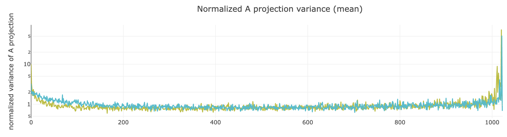
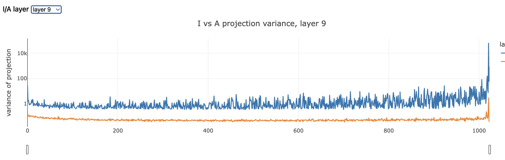
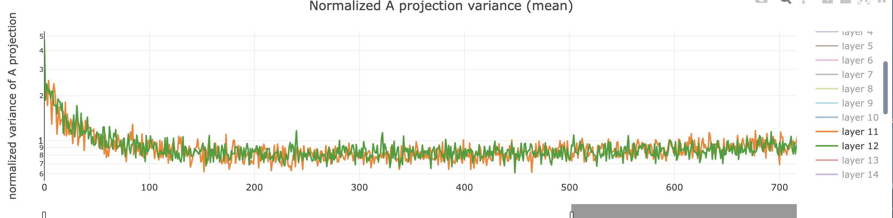

# 方差增长区间能否定位每层新增信息

## 1. 一句话 Intuition

> 我们曾观察到不同层 attention 输出在各层参数谱 rank 上具有不同的方差分布；如果方差增长区间真的定位了本层新增信息，那么该区间不仅应该在层间出现稳定正增长，还应该表现出新信息强于旧信息、并比对照子空间更能区分数据的性质。

---

## 2. 研究问题与当前结论

我们想要研究的是：

> 能否利用不同层 attention输出 在参数谱上的方差变化，找到本层相对上一层新增的信息？

我们认为这件事成立需要两个假设：

1. 本层新增的信息落在相比上一层方差增长最大的区间。
2. 如果我们想要使用这个子空间中的新信息区分数据，应当观察到新信息的方差大于旧信息。

当前结论是：

1. **没有观察到新信息在选定区间中强于旧信息。** 区间方差比平均0.1，旧信息的方差更大。
2. **选中子空间没有比同维随机方向表现出更强的 domain 区分性。** 五层 linear-probe accuracy 的差值正负交替，最大提升为 $+0.58$ 个百分点。
3. **方差出现明显不同区间的现象没有在所有层观测到。

因此，当前结果不支持通过方差增长区间定位本层新增信息。

---

## 3. 实验一：选定区间中旧信息与候选新信息的方差

### 3.1 实验做了什么

首先将不同层的 attention/oracle 表征分别投影到各层参数矩阵的右奇异方向，并将每层曲线按自身总方差归一化。下图展示了不同层的 normalized oracle variance curve 在部分参数区间确实存在明显差异，这是后续选择方差增长区间的观察基础。



在确认存在候选方差差异区间后，再比较该区间中旧信息与候选新信息的 raw variance。

对每个目标层，将两类表征投影到该层 MLP gate/up input parameter-SVD basis：

- $I_l$：进入本层的 residual/input 表征，作为已经在 residual stream 中存在的旧信息候选；
- $A_l$：residual addition 之前的 raw attention output/oracle，作为本层新写入信息的候选。

对每个参数方向 $v_{l,j}$ 计算：

$$
V^{I}_{l,j}=\mathrm{Var}_t\!\left(\langle I_{l,t},v_{l,j}\rangle\right),
\qquad
V^{A}_{l,j}=\mathrm{Var}_t\!\left(\langle A_{l,t},v_{l,j}\rangle\right).
$$

图中纵轴使用 log scale，用于同时显示谱头、中部和谱尾的多个数量级。



完整交互网页：[`20260810_oracle_projection_variance_visualize.html`](assets/20260810_oracle_projection_variance_visualize.html)

### 3.2 实验结果

在图中，$I$ 的方差曲线在大部分参数方向上都高于 $A$。在修订后选中的固定 160 维区间中，五层得到：

```text
L5:  oracle/residual variance = 0.140
L10: oracle/residual variance = 0.120
L15: oracle/residual variance = 0.131
L20: oracle/residual variance = 0.086
L25: oracle/residual variance = 0.060
```

也就是说，residual/input 在区间中的 raw variance 约为 oracle 的 $7.1$--$16.7$ 倍。

这里不能由此推断“attention 没有新信息”，因为两类表征整体尺度不同，而且 raw variance 不是信息量的完整定义。但它直接反对了本实验所需的强假设：

> **方差增长区间中并没有出现“候选新信息方差强于旧信息”的现象。**

---

## 4. 实验二：选定子空间是否更能区分 domain

### 4.1 实验做了什么

对五个目标层分别选择一个固定 160 维的连续子空间：

1. 每层 oracle variance curve 分别归一化；
2. 计算相邻层同 normalized rank 位置的 signed growth；
3. 以 5 个方向为小窗口；
4. 在参数谱前 $75\%$ 内，选择累计 growth 最大的连续 160 维区间。

然后使用同一批 4,000 个 SFT-mixture documents，比较 selected directions 与 5 组同维 random-direction controls 上的 96-class SFT-source linear probe。随机猜测准确率为 $1/96=1.04\%$。

### 4.2 实验结果

| 目标层 | Selected directions | Selected 准确率 | 未选中 random directions 平均准确率 | 随机猜测准确率 | Selected 相对 random 变化 |
|---:|---:|---:|---:|---:|---:|
| 5 | 0--159 | 85.23% | 85.15% | 1.04% | +0.08 pp |
| 10 | 425--584 | 86.23% | 85.65% | 1.04% | +0.58 pp |
| 15 | 0--159 | 82.73% | 84.29% | 1.04% | -1.56 pp |
| 20 | 0--159 | 87.23% | 86.97% | 1.04% | +0.26 pp |
| 25 | 530--689 | 83.63% | 83.91% | 1.04% | -0.28 pp |

所有 160 维子空间都远高于随机猜测，说明 domain/source 信息广泛存在于 oracle 表征中。但 selected 相对 random-direction control 的差值很小且正负交替：

> **方差增长选择器没有稳定选出比其他同维方向更具 domain 区分性的子空间。**

当前 random control 是在 selected 之外随机抽取 160 个不连续方向，因此它同时改变了“是否被增长规则选中”和“方向是否连续”两个因素。该限制不改变“selected 没有稳定优势”的当前观察，但后续若要严格隔离选区规则，还需要随机连续 160 维窗口对照。

---

## 5. 实验三：明显方差增长区间并未在所有层出现

固定宽度实验中，每个层对都在前 $75\%$ 参数谱中比较 122 个宽度为 160 的候选窗口。

- $4\rightarrow5$、$14\rightarrow15$、$19\rightarrow20$ 的最大增长区间都是最前 160 个方向；
- $9\rightarrow10$ 在 directions 425--584 出现中部正增长区间；
- $24\rightarrow25$ 的 122 个候选窗口全部为负，即在当前定义下不存在固定 160 维的正增长区间。

在其他相邻层的归一化 oracle variance 曲线中，也能看到部分层的前中部趋势非常接近，并不总是存在一个宽而明显的增长区间。



因此，位置假设当前也只能部分成立：

> **选择器可以在部分层对中找到正增长区间，但这不是每层都存在的普遍现象；而且“正增长”本身尚未被证明就是“新信息”。**

---

## 6. 补充观察：跨层不变的 SAE feature 主要是什么

这一部分是之前相邻层 feature identity 实验的独立补充，**不参与上面对导师方差区间假设的说明和支撑**。

当前将相邻层在阈值 $0.5$ 下保持稳定对应的 feature 称为 matched/persistent，并与 candidate-born/disappeared feature 比较。当前观察为：

1. **它们不是单纯的高频 token feature。** matched feature 每个 feature 的激活次数更多，但 activation-weighted token corpus frequency 没有稳定更高；按全部激活事件统计，top-$10\%$ 高频 token 也基本没有优势。
2. **它们激活在更窄、更重复的 token/结构集合上。** matched feature 的 token entropy 在 source 和 target 两侧均为 $27/27$ 个 transition 更低，而且控制 firing count 后仍然成立。
3. **它们更 domain-general。** matched 的 domain KL 中位差约为 $-0.20$ (source) 和 $-0.21$ (target)，domain entropy 与 coverage 更高。
4. **它们在数据 PCA 空间中更靠前。** matched feature 的 data-PC spectral centroid 平均低约 $0.03$，head-$25\%$ mass 更高，tail-$10\%$/tail-$25\%$ mass 在几乎全部 transition 中更低。
5. **但它们没有稳定位于 MLP 参数谱头部。** matched/unmatched 的 parameter-SVD head/tail mass 和 spectral centroid 差异都很小，而且方向随层变化。

因此，跨层稳定 feature 更像：

> **在许多层都会反复遇到、激活范围较窄但 domain 覆盖较广的共享 token/结构模式；它们对齐数据的主 PCA 骨架，但不固定占据各层 MLP 参数谱头部。**

---

## 7. 今日结论

1. 不同层 attention/oracle 的方差 rank profile 确实不同。
2. 在选定区间中，旧 residual/input 的 raw variance 仍大于 attention/oracle，选中方向的 domain 区分性也没有稳定超过同维随机方向。
3. 固定宽度的正增长区间并非每层都存在。

因此，当前这套方法只能定位 oracle variance redistribution，不能单独定义或定位新信息。
