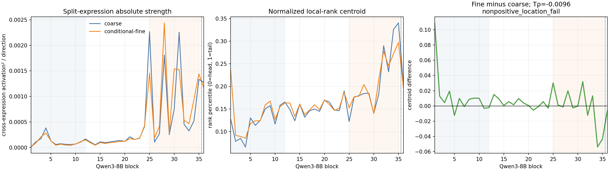
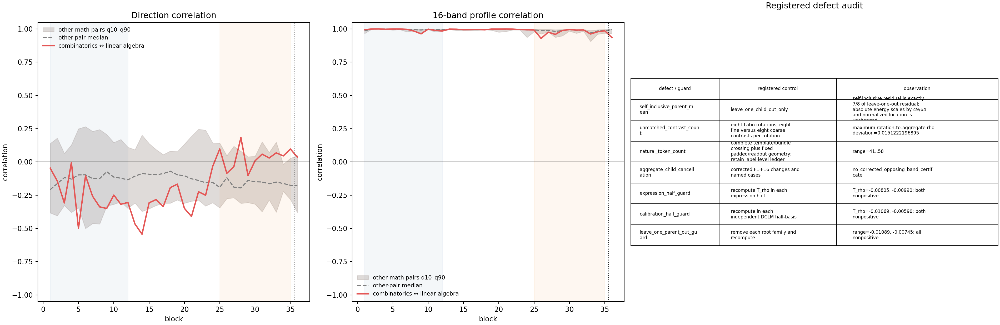

# A15_02_05_E01 Balanced-Taxonomy Attention-Write Atlas — Result Summary

Primary Anchor: `A15_02_05` in the source Research System.
Frozen Protocol: `A15_02_05_E01_r1` in the source Research System.
Detailed record: intentionally omitted from this curated handoff.
Result status / eligibility: **ELIGIBLE; registered Fail.** The knowledge wording below is an AI-drafted bounded reading under the researcher's execution delegation and awaits researcher correction or confirmation.

## Result Snapshot

**Registered verdict: `nonpositive_location_fail`.** In the actual attention-induced MLP-input increment $\Delta n$, conditional-fine semantic residuals are reliable and become stronger with depth, but they do not acquire an additional rightward local-spectral relocation relative to coarse parent residuals. The paired fine-minus-coarse location advantage changes from +0.009334 in blocks 1--12 to -0.000239 in blocks 25--35, giving

$$
T_\rho=-0.009573,
\qquad
\text{one-sided 95% interval }[-0.011199,-0.004492].
$$

Here $\rho$ is the energy-weighted percentile of a layer's own DCLM covariance ranks: 0 is the local high-variance end and 1 the local low-variance end. $T_\rho$ is the registered late-minus-early change in fine minus coarse $\rho$. Its interval is wholly nonpositive, so the fine-specific right-shift hypothesis fails rather than remaining imprecise.

## What The Result Changes

The experiment separates **semantic strength** from **spectral location**. Root-family bootstrap lower bounds for coarse and fine absolute cross-expression energy are positive in both early and late windows, and the median fine strength rises from $8.01\times10^{-5}$ to $9.41\times10^{-4}$ activation squared per direction. The Fail is therefore not caused by the absence of a reproducible fine-semantic contrast. It says that depth does not give that contrast a later local-rank position beyond the movement already present for coarse academic distinctions.

This conclusion is stable under every registered replication guard. The two expression halves give $T_\rho=-0.008048$ and $-0.009896$; the two independent DCLM half-bases give -0.010694 and -0.005900; and all eight leave-one-parent-out values are negative, spanning [-0.010891, -0.007446]. The parent-preserving permutation q95 is -0.006383, above the observed estimate. Block 36, excluded from the decision windows, also remains negative at -0.005593.

The full F1--F16 audit does not identify a replacement band after the Fail. F2--F7 have descriptive positive fine-minus-coarse normalized changes, while F8--F16 are negative; only F1 survives the registered max-statistic correction, and no absolute bandwise change survives it. There is no corrected opposing-band cancellation certificate. This pattern motivates the already independent middle audit, but does not establish that middle carries fine semantics or function.

## Representation-Site Boundary

The isolated post-`o_proj` attention write gives a descriptive $T_\rho=+0.011327$, whereas the registered actual $\Delta n$ gives -0.009573. Thus the apparent direction of relocation depends on whether one measures the source write or its same-layer residual-plus-RMSNorm effect at the actual MLP input. This does not prove that RMSNorm or the residual path causally destroys information; it prevents promoting a post-`o_proj` curve into a site-independent layerwise law.

## Named Mathematics Cases

`combinatorics - mathematics` and `linear algebra - mathematics` are operational child-minus-sibling-centroid residuals, not subtraction from an independently observed mathematics vector. Both are split-half reliable in all 36 blocks: their minimum same-layer reliabilities are 0.603 and 0.639. Their own rank centroids move rightward by +0.073492 and +0.057032, respectively, yet this cannot rescue the failed fine-minus-coarse interaction.

The deeper update is that similar band profiles do not imply a shared semantic direction. The two cases have very similar same-layer 16-band profiles (overall median correlation 0.9943), but their same-layer raw directions have overall median cosine -0.1801 and remain inside the envelope of all 28 mathematics child pairs. Within each case, off-diagonal cross-layer direction cosines stay near zero even while cross-layer 16-band-profile correlations are high. Band allocation is therefore a coarse spectral description; it does not identify a transported semantic vector.

## Claim Boundary And One Next Decision

This result establishes a precise negative answer only for fine-specific local-rank relocation in one frozen Qwen3-8B, one balanced English academic taxonomy, one readout geometry, and the actual $\Delta n$ representation. It does not show that fine semantics are absent, that no layerwise semantic organization exists, that the middle or tail is functional, that directions are never reusable, or that a Router or expert would gain or fail from spectral selection.

**Exactly one next decision:** review and either approve or correct the independent A15_03 middle-band decomposition so that it explicitly tests whether apparent middle structure survives absolute-energy, within-middle, cross-layer-direction, representation-site, and Haar controls. Completion requires one frozen middle object and one verdict that cannot be rescued by post-hoc bands or named cases. The historical A15_03 draft Protocol remains in the source Research System and is intentionally omitted here; do not start a Router experiment.
