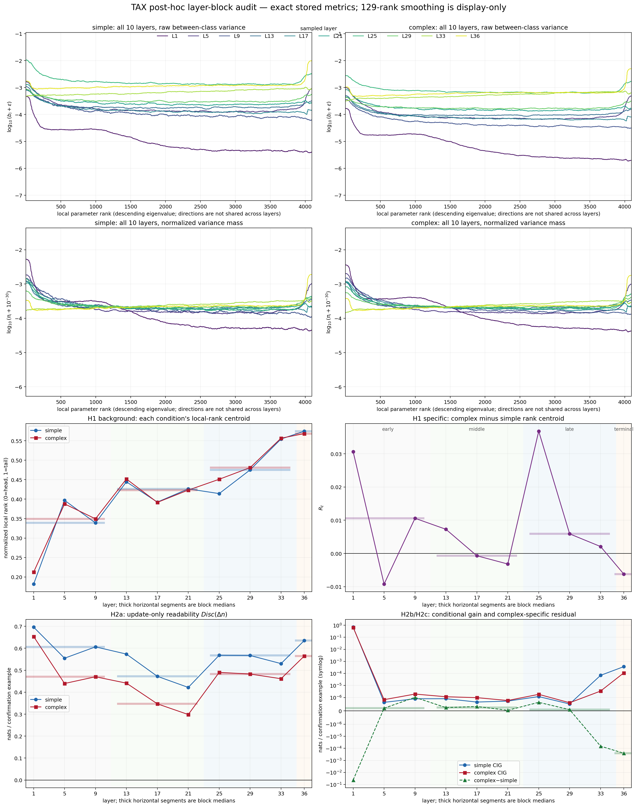

# Full Result Summary: Matched Taxonomy 10-Layer Run

## Direct Result

All registered TAX guards passed, but neither hypothesis passed or failed. The H1 late-minus-early rank-shift statistic was $-0.004690$ with a paired-bootstrap 95% interval of $[-0.012182,0.009295]$; DEVELOPMENT was also negative at $-0.006365$. The H2 conditional-novelty statistic was $-1.09\times10^{-7}$ nats/example with interval $[-4.30\times10^{-7},5.92\times10^{-7}]$. Both intervals cross zero, so the registered outcome is `insufficient_mixed`.

The result does **not** support the proposed gradual movement of complex information toward later local parameter ranks. It also does not establish movement in the opposite direction.

## Metric Meaning

- $R_\ell$ is the complex-minus-simple difference between normalized variance centroids in one layer's own descending parameter-eigenvalue order. Positive means relatively more complex variance lies at later local ranks; it never identifies the same vector across layers.
- $T_{rank}$ is median $R_\ell$ on layers 25/29/33 minus its median on layers 1/5/9.
- Conditional information gain (`CIG`) is the confirmation cross-entropy improvement from adding a linear $\Delta n$ correction after an $n^{old}$ readout is fitted and frozen. It is the H2 measure of linearly accessible information not already supplied by $n^{old}$ under this readout family.
- $Disc(\Delta n)=\log8-CE(\Delta n)$ measures whether the update alone is linearly readable. It is supporting evidence, not evidence of conditional novelty.

## Decisive Evidence

| Clause | Registered point estimate | 95% paired-bootstrap interval | Split/guard check | Verdict |
| --- | ---: | ---: | --- | --- |
| H1: later normalized rank allocation | $-0.004690$ | $[-0.012182,0.009295]$ | DEV $-0.006365$; all guards pass | Insufficient |
| H2: later conditional novelty | $-1.09\times10^{-7}$ | $[-4.30\times10^{-7},5.92\times10^{-7}]$ | all guards pass | Insufficient |

The first four panels place all ten sampled layers on shared axes, separately for simple/fine and raw/normalized variance. The lower panels separate the common rank relocation, fine-minus-simple residual, update-only readability, and conditional novelty. Thick horizontal segments are descriptive medians for early 1/5/9, middle 13/17/21, late 25/29/33, and terminal 36. This post-hoc block view does not re-adjudicate the registered H1/H2 verdict.

| Layer block | Median fine/simple raw trace | Simple centroid | Fine centroid | Fine−simple $R$ | Fine $Disc(\Delta n)$ | Fine−simple CIG |
| --- | ---: | ---: | ---: | ---: | ---: | ---: |
| Early | 0.5242 | 0.3389 | 0.3495 | +0.0106 | 0.4702 | $+2.00\times10^{-7}$ |
| Middle | 0.5541 | 0.4264 | 0.4232 | -0.0007 | 0.3470 | $+2.46\times10^{-7}$ |
| Late | 0.5484 | 0.4751 | 0.4810 | +0.0059 | 0.4826 | $+9.17\times10^{-8}$ |
| Terminal | 0.5386 | 0.5746 | 0.5684 | -0.0062 | 0.5644 | $-2.55\times10^{-4}$ |

All overlay curves use a centered 129-rank arithmetic mean applied to linear variance before `log10`. Smoothing is display-only and changes no centroid, block value, confidence interval, or verdict. The H2 panel uses a symmetric-log axis to preserve sign while showing both near-zero and large gains.

## Evidence-Based Knowledge Update

1. Matching both conditions to eight classes and one leaf per class removes the previous coarse-versus-fine covariance-cardinality mismatch, but it does not reveal a stable depth-wise rank shift. $R_\ell$ changes sign across the ten layers rather than moving approximately monotonically.
2. Complex TAX has lower total between-class variance than simple TAX at every sampled layer. Therefore raw magnitude and normalized spectral location are distinct objects; normalization is necessary for H1 but cannot be read as preserved signal strength.
3. The update $\Delta n$ alone remains readable after layer 1 (`Disc($\Delta n$)` is roughly 0.30--0.70 nats/example), while its extra gain beyond $n^{old}$ is nearly zero from layers 5--29 and remains very small at layers 33--36. Under the registered linear readout, readable update information is therefore largely redundant with information already accessible in $n^{old}$ rather than demonstrably new.

The third statement is an interpretation bounded by the readout family. It cannot distinguish true representational redundancy from conditional information that a linear ridge correction cannot recover.

## Claim Boundary

This run establishes a valid, cardinality-matched TAX measurement and rules out treating the earlier three-layer visual pattern as sufficient evidence for a global later-rank shift. It cannot prove no depth effect exists, compare semantic difficulty exactly, identify shared directions, establish nonlinear conditional information, or infer causal use by the MLP. TAX remains separate from composition.

## Researcher Close-Out

- **Question:** Under a class-count-matched taxonomy, does conditional-fine information move relatively toward later local MLP-parameter ranks with depth and add linearly accessible information beyond the old MLP input?
- **Direct result:** No. $T_{rank}=-0.004690$ with interval $[-0.012182,0.009295]$, and conditional information gain is $-1.09\times10^{-7}$ nats/example with interval $[-4.30\times10^{-7},5.92\times10^{-7}]$. Both registered clauses are `insufficient`.
- **Updated judgment:** Matching covariance cardinality removes the old coarse/fine estimator mismatch but does not reveal a stable fine-specific rank relocation or conditionally new linear information. The retained observation is a target-common depthwise relocation of local-rank centroids.
- **Cannot claim:** TAX does not establish absence of nonlinear information, native MLP use, a functional tail, or Router utility; lower fine readability alone is not evidence for a nonlinear code.
- **Next decision:** Close A15_02_07 jointly with COMP and allow only one A15_04 fixed-bank geometry test of whether the shared relocation aligns with the cross-layer parameter tail beyond equal-rank random, head, and middle controls.
