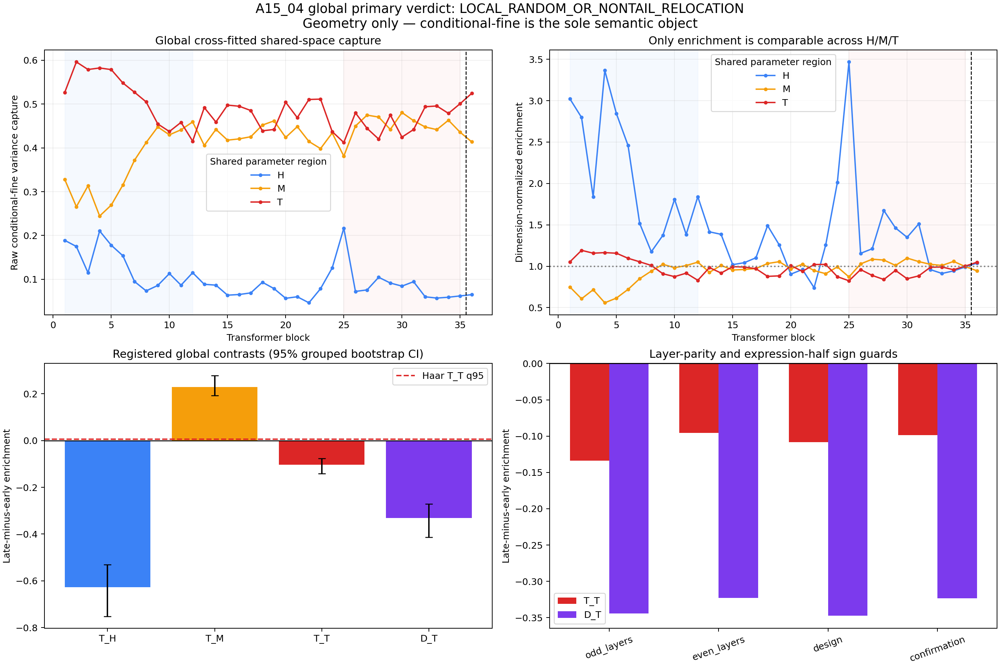
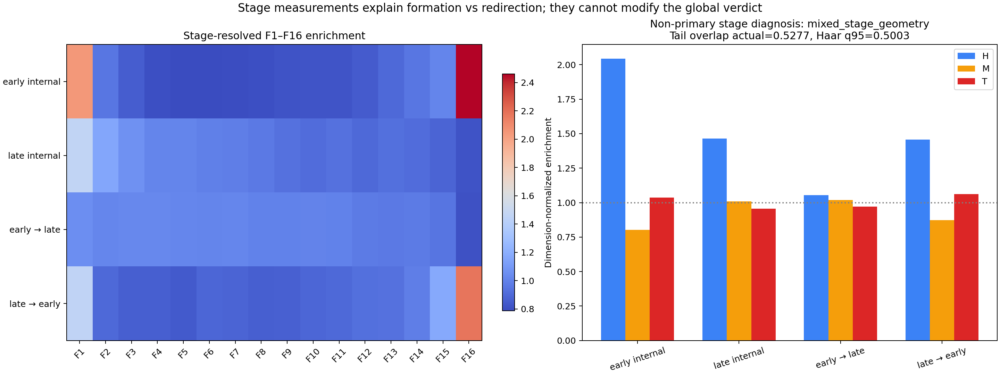

# A15_04_E01 Shared-Tail Geometry — Result Summary

## Outcome

**Registered verdict: Fail — `LOCAL_RANDOM_OR_NONTAIL_RELOCATION`.** On the frozen 512-record set, conditional-fine variance does move toward later ranks in each layer's own MLP parameter ordering, but it does **not** become increasingly enriched in the global cross-layer shared F9--F16 tail. The retained phenomenon is therefore a local-rank redistribution, not an admitted shared-tail coordinate.

The only semantic object in this result is within-parent between-child covariance of the actual attention-induced MLP-input increment $Delta n$. The result does not measure MLP use, task function, or Router benefit.

## Decisive Evidence

Dimension-normalized enrichment divides variance capture by the capture expected from a random space of the same dimension. A value of 1 is therefore the matched-random reference, and late-minus-early change is comparable across the 256-dimensional head, 1,792-dimensional middle, and 2,048-dimensional tail.

| Registered quantity | Point estimate | Grouped-bootstrap 95% interval | Reading |
| --- | ---: | ---: | --- |
| local rank-centroid change $T_{rank}$ | +0.101228 | [0.087289, 0.113888] | the local-rank phenomenon reproduces |
| local broad-tail enrichment change $T_{LT}$ | +0.247581 | [0.210290, 0.276835] | local F9--F16 share increases |
| global shared head change $T_H$ | -0.627714 | [-0.752033, -0.529997] | shared head decreases |
| global shared middle change $T_M$ | +0.228442 | [0.193216, 0.278302] | shared middle increases |
| global shared tail change $T_T$ | -0.103453 | [-0.142083, -0.076752] | shared tail decreases |
| tail specificity $D_T=T_T-\max(T_H,T_M)$ | -0.331895 | [-0.412888, -0.271072] | tail loses to middle |

The result is a stable falsifier, not an unstable estimate. Tail change was negative in odd layers (-0.133993), even layers (-0.095583), the design expressions (-0.108435), and the confirmation expressions (-0.098851). Across 32 valid FP16-coordinate perturbations, $T_T$ remained in [-0.103467, -0.103441] and $D_T$ in [-0.331920, -0.331870]. The actual late tail enrichment was 0.950114, below the 512-Haar q95 of 1.002485; actual $T_T$ was also below its Haar q95 of 0.005189.

The complete F1--F16 evidence shows why no endpoint may be selected after seeing the result: F9--F13 increase, while F14--F16 decrease, with F16 strongly negative. The registered broad F9--F16 union must remain the decision object; a post-hoc narrower tail cannot rescue it.

## Non-Primary Stage Diagnosis

The stage label is `mixed_stage_geometry`. Early-built and late-built tail parameter projectors overlap above Haar (0.527685 versus q95 0.500301), so the parameter tail is not merely two unrelated random half-spaces. However, tail semantic enrichment exceeds Haar only for early-internal evaluation (1.035302) and late-built-on-early evaluation (1.062454), not for late-internal evaluation (0.955330) or early-built-on-late evaluation (0.970624). This does not match registered global stability, late formation, or symmetric stage redirection, and it cannot modify the global Fail.

## Claim Boundary And Next Decision

This result closes the claim that local conditional-fine rank relocation enters a globally reusable shared F9--F16 tail on this dataset. It does not show that tail directions are unused, random, nonfunctional, or unsuitable for every nonlinear method. It also does not establish that the shared middle is functional.

**Exactly one next decision:** decide whether the already independent A15_03 middle-band audit should be approved to test whether the positive shared-middle change is a real within-middle structure rather than normalization or rank-averaging. No functional or Router experiment is admissible from A15_04.

The full detailed ledger remains in the source Research System and is intentionally omitted from this curated handoff. The included 16-band and direction-level displays are [figure 1](figures/figure1_full_16band_spectrum.png) and [figure 3](figures/figure3_direction_variance_curves.png).
