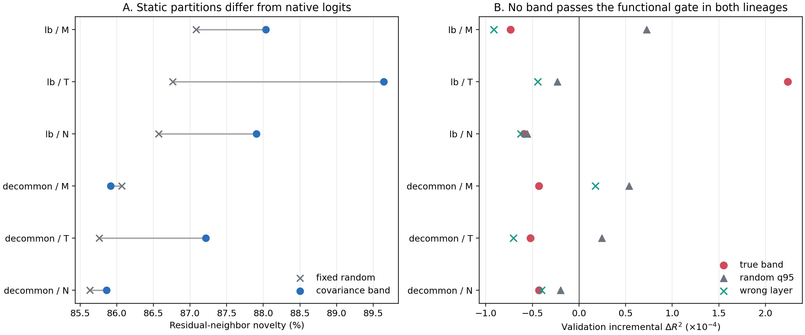

# Summary: A15_05_04_E01 Cross-Update Compatibility Gate

Primary anchor: `A15_05_04 compatibility gate` in the source Research System.
Protocol: approved in the source Research System.
Detailed record: intentionally omitted from this curated handoff.

## Result Snapshot

**Verdict:** scientific **FAIL** for the registered fixed-band admission
question; operational measurement guards passed.

**What we established:** middle, covariance long-tail, and their union produce
token neighborhoods different from those induced by native Router scores.
However, no band supplied a stable held-out increment for predicting
bidirectional one-step same-expert compatibility in both LB and decommon while
also beating equal-dimensional random and wrong-layer controls.

**What the experiment shows:** a different high-dimensional partition is not
by itself a functional routing coordinate. In this registered setup, fixed
covariance-rank M/T/N geometry did not earn admission to matched joint
training.

**What we do next:** decide whether to close fixed covariance bands as direct
dispatch coordinates or open a new anchor that defines a function-aligned
subspace from expert gradients or cross-update residuals. The conditional
8×5090 E02 remains blocked.

## Purpose

The experiment asks whether non-head coordinates add functional information
that the trained linear Router score does not already contain. The target is
not the existing expert label. It is whether two independent token groups are
locally compatible when used to update the same expert.

## Terminology / Definitions

| Term | Plain meaning | Concrete object / computation | Unit or formula | Decision role | Cannot prove |
| --- | --- | --- | --- | --- | --- |
| Actual Router input | Representation directly consumed by the Gate | validated `mlp.gate` pre-input | activation | Defines the only allowed covariance basis | Expert-input geometry |
| Middle / long-tail / non-head | Registered covariance-rank subspaces | ranks 65--320 / 321--768 / 65--768 | 256 / 448 / 704 dimensions | Candidate fixed bands M/T/N | Semantic meaning |
| Residual-neighbor novelty | How many band neighbors differ after linear native-score removal | $1-|\mathrm{kNN}_{band}\cap\mathrm{kNN}_{native}|/32$ | fraction | Static diagnostic only | Co-training benefit |
| Compatibility $C(A,B)$ | Whether updating one expert on A helps B and vice versa | negative mean bidirectional cross-loss change | nat/token | Independent local functional target | Long-horizon benefit |
| Incremental $\Delta R^2$ | Extra held-out compatibility prediction from two band-pair features | $R^2(\mathrm{base}+S)-R^2(\mathrm{base})$ | $R^2$ difference | Primary admission metric | Matched-training improvement |
| Random q95 | High control value from arbitrary same-dimensional orientations | 95th percentile over 256 Haar subspaces | $R^2$ difference | Rejects generic dimensional geometry | Layer specificity |
| Wrong-layer control | Same covariance ranks taken from a preregistered different layer | identical pair features and model | $R^2$ difference | Rejects arbitrary-layer geometry | Absence of shared cross-layer structure |
| Candidate $S^*$ | Band legally admitted to training | must pass every registered gate in both lineages | discrete selection | Unlocks conditional E02 | Endpoint benefit by itself |

## Exact Setup

- **Models:** 12-layer, width-768, eight-expert, top-1 LB and decommon
  checkpoints at 80k; preregistered layers 1, 6, and 12.
- **Data:** 512 new held-out DCLM documents split by whole document into 64
  operationalization, 192 fit, 128 validation, and 128 locked final documents.
- **Groups:** A and B each contain 32 loss-bearing tokens from different
  documents and batches, natively routed to the same target expert.
- **Local intervention:** update only that expert once on A, measure B, restore
  exactly, then reverse A/B; all native routes and other parameters stay fixed.
- **Prediction model:** standardized low-capacity ridge. Native logits, margin,
  expert identity, load, token loss, norm, position, gradient magnitude,
  outliers, document, batch, and band energy are controls. Each band adds only
  cosine and squared distance of group-mean projected coordinates.
- **Direction controls:** 256 equal-dimensional full-space random bases,
  non-head random bases where defined, and a preregistered wrong-layer basis.
- **Evidence volume:** all 3,072 fit/validation A/B pairs completed; no final
  functional set, 40k replication, four-layer transfer, or training arm was
  opened after the empty-candidate stop rule.
- **Known limitation:** the result concerns one-step frozen-route compatibility
  under two direction-only pair features and a low-capacity predictor. It does
  not exclude nonlinear, semantic, or long-horizon non-head utility.

## Primary Metric And Decision

For candidate band $S$,

$$
\Delta R_S^2
=R^2_{validation}(C\mid X_{native},\phi_S)
-R^2_{validation}(C\mid X_{native}).
$$

Admission required a positive model-level median, superiority to the matched
random q95 and wrong-layer control, valid document-bootstrap precision, and
reproduction in both LB and decommon before transfer or training. This strict
cross-lineage rule protects against selecting a lineage-specific fluctuation.
Its false-positive cost is an unjustified matched-training run; its false-
negative cost is missing a band that may work only nonlinearly or over longer
horizons.

## Key Evidence

Compatibility was measurable: self-loss decreased in every probe, expert
parameters restored exactly, primary-versus-half-step Spearman correlations
were 0.87--1.00, and compatibility correlated 0.71--0.96 with exact expert-
gradient cosine.

Model-level median validation $\Delta R^2$, in units of $10^{-4}$:

| Band | LB true | LB random q95 | decommon true | decommon random q95 | Admission |
| --- | ---: | ---: | ---: | ---: | --- |
| Middle | -0.735 | +0.725 | -0.430 | +0.536 | Fail |
| Long-tail | +2.237 | -0.233 | -0.520 | +0.244 | Fail |
| Middle + long-tail | -0.590 | -0.554 | -0.429 | -0.198 | Fail |

Long-tail passed the point-estimate gates in LB alone, but was negative and
below random in decommon. Document-bootstrap intervals included zero for every
model-band summary. The candidate set was therefore empty.

Static residual-neighbor novelty was 73.2%--90.2% for true M/T/N and
71.4%--87.7% for one fixed equal-dimensional random reference. This confirms
that non-head changes the partition while showing that much of the novelty is
generic to a high-dimensional view.

## Key Figure

### Static novelty does not imply functional admission

**Question:** does a new spectral neighborhood also predict which groups can
train one expert compatibly?
**Metric and unit:** left, residual-neighbor novelty in percent; right,
validation $\Delta R^2$ in units of $10^{-4}$.
**Data and aggregation:** locked final documents for the static diagnostic;
three-layer model medians on validation for functional selection.
**How to read:** the left panel asks whether partitions differ; the right asks
whether true bands beat zero, random q95, and wrong-layer controls.
**Observed result:** novelty is high for both true and random views, while no
band passes the functional gate in both lineages.
**Allowed conclusion:** fixed M/T/N geometry is not admitted under the
registered local functional criterion.
**Does not prove:** absence of nonlinear or long-horizon non-head utility, or
harm from a band-based Router.

## Claim Boundary

**Can claim:** the compatibility measurement was operationally valid; non-head
bands changed static neighborhoods; no fixed M/T/N candidate achieved the
registered cross-lineage residual-prediction admission; the stop rule correctly
blocked final selection, transfer, and matched training.

**Cannot claim:** non-head information is functionally absent; long-tail is
never useful; random routing is equivalent; a learned function-aligned
subspace would fail; or matched spectral dispatch helps or harms held-out loss
per FLOP. No training comparison was run.

## Next Decision

Exactly one decision remains: close fixed covariance M/T/N bands as direct
dispatch coordinates, or open a new approved anchor for a function-aligned
subspace. The current conditional E02 must remain blocked.
