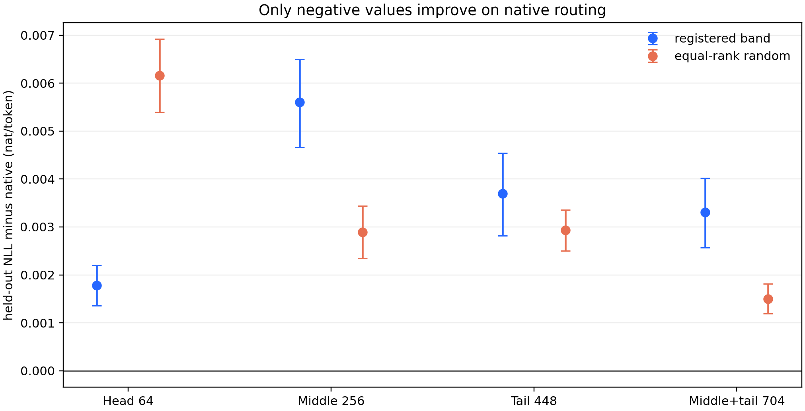
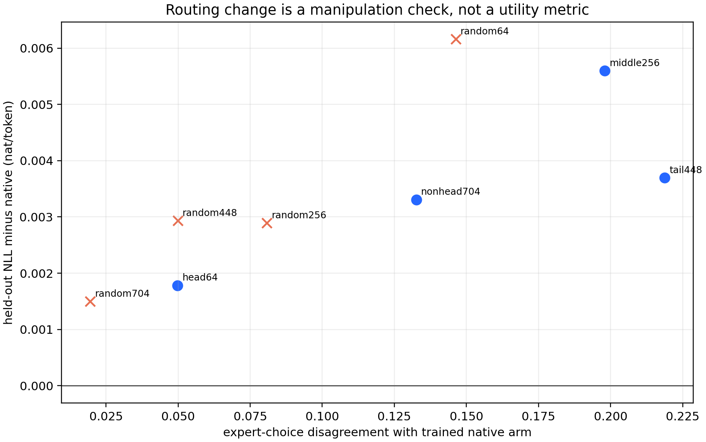

# Summary: Matched 2B Fixed-Band Dispatch

## Result Snapshot

Fixed covariance bands causally changed token-to-expert dispatch, but none
improved language-model training in this matched 2B DCLM branch. Every true
band had higher held-out negative log-likelihood (NLL) than the native Router.
Head-only was the sole true band that beat its equal-rank random control, yet
it still lost to the full native Router. Middle, tail, and middle+tail produced
alternative partitions without functional benefit.

**Verdict:** Fail / distribution-only.

## Terminology / Definitions

- **Held-out NLL** is the model's average surprise for the correct next token,
  in natural-log units per token. Lower is better. A positive
  $\Delta L=L_{treatment}-L_{comparator}$ means the treatment is worse.
- **Route disagreement** is the fraction of the same frozen DCLM tokens sent
  to a different expert than by the separately trained native arm. It proves
  that dispatch changed; it does not say the change is useful.
- **Equal-rank random control** keeps the same input dimension as a true band
  but randomly rotates the retained subspace. It separates spectral identity
  from generic dimensional restriction.

## Exact Setup

Nine arms resumed the same H768, four-layer, eight-sparse-expert top-1 MoE at
step 800 (629,145,600 tokens) and trained to step 2,544
(2,000,683,008 tokens). Experts always received the full representation; only
the Gate view was restricted. The true views were head-64, middle-256,
tail-448, and middle+tail-704, each paired with an equal-rank Haar-random view.
All arms used the same DCLM stream, optimizer, scheduler, capacity, active
parameters, and token count.

## Primary Result

Native held-out NLL was **4.246669 nat/token**.

| Gate view | Route disagreement vs native | $\Delta$ NLL vs native, 95% CI | $\Delta$ NLL vs equal-rank random | Decision |
| --- | ---: | ---: | ---: | --- |
| head-64 | 4.98% | +0.001784 [0.001359, 0.002202] | -0.004375 [-0.005152, -0.003576] | spectrally special, but incomplete |
| middle-256 | 19.80% | +0.005600 [0.004656, 0.006498] | +0.002709 [0.001867, 0.003540] | changes dispatch and is worse |
| tail-448 | 21.88% | +0.003697 [0.002816, 0.004542] | +0.000765 [-0.000094, 0.001619] | changes dispatch; no random-control gain |
| middle+tail-704 | 13.26% | +0.003308 [0.002567, 0.004019] | +0.001811 [0.001084, 0.002527] | changes dispatch and is worse |

Every interval against native is strictly above zero. The manipulation was
therefore effective, but its effect was harmful rather than beneficial.

## Supporting Evidence

- All nine 8×RTX5090 jobs completed at exactly 2.000683B nominal tokens with no
  retry, missing checkpoint, logged error, or load collapse.
- Final normalized load entropy was 0.9974--0.9983; maximum sampled train
  expert share was 0.1378 versus uniform 0.125. Load imbalance does not explain
  the NLL ordering.
- Frozen/current projector overlap was 0.572--0.968 across true bands. Spectral
  identity changed but did not disappear, so basis staleness alone cannot
  explain the negative result.
- The held-out trajectory already favored native at intermediate checkpoints;
  there was no late reversal at 2B.
- WOS domain/topic route predictability did not improve meaningfully. These
  label diagnostics are secondary and do not determine language-model quality.

## Claim Boundary And Next Decision

This is a strict paired causal result for one four-layer branch seed. It
establishes that these fixed band-only views affect dispatch and fail to
improve 2B DCLM NLL in that branch. It does not prove that middle/tail contain
no useful conditional information, because additive head+middle/head+tail
readouts and learned task-conditioned features were not tested.

**Next decision:** close fixed covariance-rank band-only dispatch as the Router
design candidate and require any future large training to first pass a
directly functional expert-update or task-utility gate.

The full detailed ledger remains in the source Research System and is intentionally omitted from this curated handoff.
