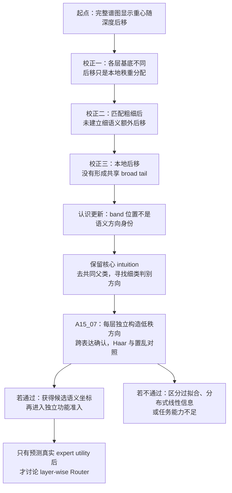

# 从谱后移到逐层细语义方向：A15 组会 Focus

```text
type: meeting_knowledge_update
status: HUMAN_CONFIRMED
scope: one_problem
```

**问题来源：**研究者在 0807 meeting notes 中提出的问题；私人原始记录未纳入本同步包。
**主要证据：**[十层 TAX 完整谱图与结果](evidence/a15_02_07/summary.md)、[shared-tail 结果](evidence/a15_04/summary.md)、[固定频带 matched-dispatch 结果](evidence/a15_05_05/summary.md)和当前 [A15_07 Anchor](anchor/15_07_layerwise_conditional_fine_discriminant_directions_anchor_cn.md)。
**本次不讨论：**Router 实现、专家功能增益、预设 middle/tail 的 band 审核，以及把条件细类差直接称为“本层新创造的知识”。

## 1. 组会主题与核心问题

**主题：** 从“层越深，语义谱越向后”推进到“每层是否存在能够稳定区分细粒度语义的低秩方向”。

**核心问题：** 验证我们的直觉是否正确：模型深层会在已有共同概念上形成更细的表征，因此每层 gating 应抓住区分这些细类的少量方向。现有谱实验究竟保留了这一直觉的哪一部分，又把下一步收窄到了什么问题？

## 2. 最确定的认识更新

1. **谱后移是真实的层间表征现象，虽不是逐层后移，但是谱重心在深层明显靠后** 每层都有自己的频谱基；后移只表示语义方差在本层秩次序中重新分配。它不能直接告诉我们哪条方向承载了新语义。

2. **粗细粒度语义后移的差别没有找到，没有建立“越细的语义越比粗语义靠后”的统一规律。** 粗粒度和细粒度任务都会随深度发生谱重排；在类别数匹配后，细粒度相对粗粒度的额外后移没有形成稳定趋势。因此，不能再用“更后秩”作为细语义的定义。

3. **频带位置和语义方向是两个不同对象；不同层之间，我们发现MLP的common部分和tail（特别是最后128维）尽管有参数重叠，但是逐层的对应频段的功能不能一起比较** 相同的本地秩或相似的频带曲线只说明能量落在相近区间，不保证不同层对应同一方向。进一步的 shared-tail 检验也没有把本地后移还原成一组跨层共享的tail方向。

4. **需要先寻找和验证逐层细分的细语义方向，找到语义方向之后，再与不同谱段进行比较，得出语义的身份** 真正应该保留的不是“细语义在后谱段”，而是：去掉父类共同部分后，同一父类内部的细类差异是否集中在少量方向中；这些方向是否在换模板、事实和措辞后仍可复现；不同层是否需要分别定义自己的方向。

## 3. 从谱图到下一问题的逻辑链

### 3.1 我们最初看到了什么？


图的横轴是每层自己的 MLP 参数增益秩，左侧是本层高增益方向，右侧是本层低增益方向；不同层相同的横坐标不是同一个向量。图中粗、细任务的谱重心都会随深度总体后移，因此最初“深层表征发生了谱重分配”的观察成立。

但决定性比较不是细任务自己是否后移，而是它是否比匹配的粗任务**额外**后移。这个差异随层改变符号，没有形成稳定的深度趋势。于是第一层认识更新是：**谱后移描述的是目标共同的层间重分配，而不是细语义独有的后谱定位。**

### 3.2 这对我们的直觉意味着什么？

 Intuition 可以拆成两部分：

- 上一层或共同概念提供背景，例如“数学”；
- 当前层需要少量方向区分“组合数学、线性代数”等更细类别。

第一部分不能通过直接相减不同层的 covariance 或 eigenvector 来实现，因为不同层没有天然对齐的方向身份。可执行的替代是：在**同一层**内先减去数学父类共同中心，只研究同父类 child 之间的差异。这样得到的是“该层是否含有条件细类区分”，而不是声称这一层刚刚创造了这些知识。

关于 head，还保留一个竞争解释：纯粹对所有类别相同的 additive mean 已会被父类中心化消去；真正可能造成 head 集中的，是一个跨样本共享、但不同细类具有不同幅度的公共方向。是否把该公共方向投影掉并复测判别能力，仍是 `AI_PROPOSAL_AWAITING_HUMAN_CONFIRMATION`，应作为对照而不是新的 band 选择规则。

### 3.3 为什么现在不先选 middle 或 tail？

因为我们已经知道：

- 本地后秩不等于跨层共享 tail；
- 一个宽 band 含有较多总能量，可能只是因为维度更大；
- 固定 covariance band 改变分发，也没有因此获得功能准入。

所以，继续争论“细语义究竟在 head、middle 还是 tail”会把位置当成身份。当前更直接的问题是：**能否从每层表征中学出一个小秩子空间，只用一组表达构造，却能在另一组表达上继续区分同父类细类，并超过同秩随机空间和标签置乱？**



### 3.4 下一步怎样回答，而不是继续画谱？

当前 A15_07 的候选做法是：对每层分别寻找“细类中心差异大、同一细类跨表达波动小”的低秩方向；用一半表达构造，用另一半表达确认，再双向交换。主结果是逐层的留出判别优势，同时比较同秩 Haar 随机空间和父类内标签置乱。

可能的认识更新只有三类：

| 结果 | 认识更新 | 后续行动 |
| --- | --- | --- |
| 某些层的低秩方向跨表达稳定并超过两类随机对照 | 这些层获得条件细语义候选坐标 | 进入独立功能准入，不直接训练 Router |
| 全空间可分，但低秩方向不优于随机 | 细类线性信息存在，但没有低秩集中证书 | 转向分布式、稀疏或局部方向结构，不回头挑 band |
| 构造集很好、留出表达失败，或全空间能力不足 | 当前方向是表达捷径/小样本过拟合，或任务尚无判断能力 | 先修复对象与能力，不解释频谱功能 |

## 4. 当前边界与行动更新

- **认知层面：**我们从“深层细语义应向后谱移动”推进到了“细语义位置未知，必须先取得逐层、跨表达的方向身份证明”。这是对导师 intuition 的精确化，不是否定导师关于逐层细化和低秩 gating 的动机。
- **行动层面：**A15_03 middle 审核继续 parked；不继续扩展 tail；不再以 band 位置选择候选方向；当前只审核 A15_07。
- **不能声称：**深层没有细语义、middle/tail 没有信息、A15_07 方向会被模型自然使用、不同层功能上必须使用不同方向，或 Router 会因此获得收益。

**唯一下一决策：**确认或修改 [A15_07 Anchor](anchor/15_07_layerwise_conditional_fine_discriminant_directions_anchor_cn.md) 的六个设计点，并裁定“投影公共均值方向”是否加入为必要对照。
**完成标准：**冻结表征对象、conditional-fine 标签、跨表达拆分、候选秩与收缩范围、逐层留出优势指标、随机对照，以及 Pass 只开放功能准入而不开放 Router 训练的边界。
**恢复动作：**人工确认后，基于同一 Anchor 写一份 `DRAFT_NOT_EXECUTABLE` Protocol；在 Protocol 获得单独批准前，不实现、不 smoke、不运行。
